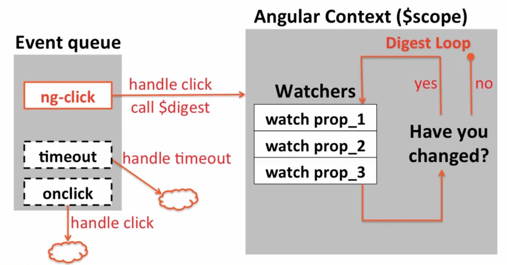
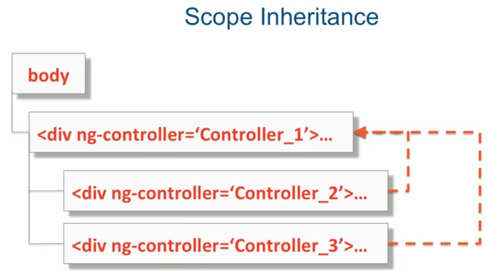
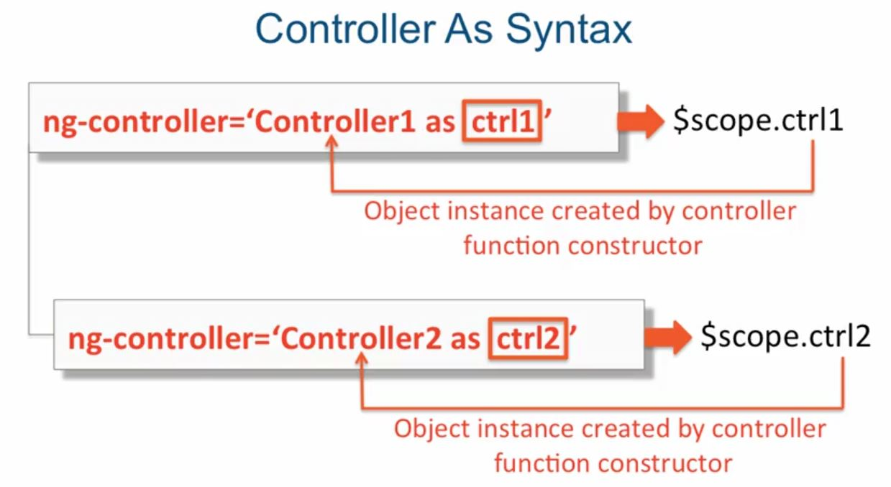
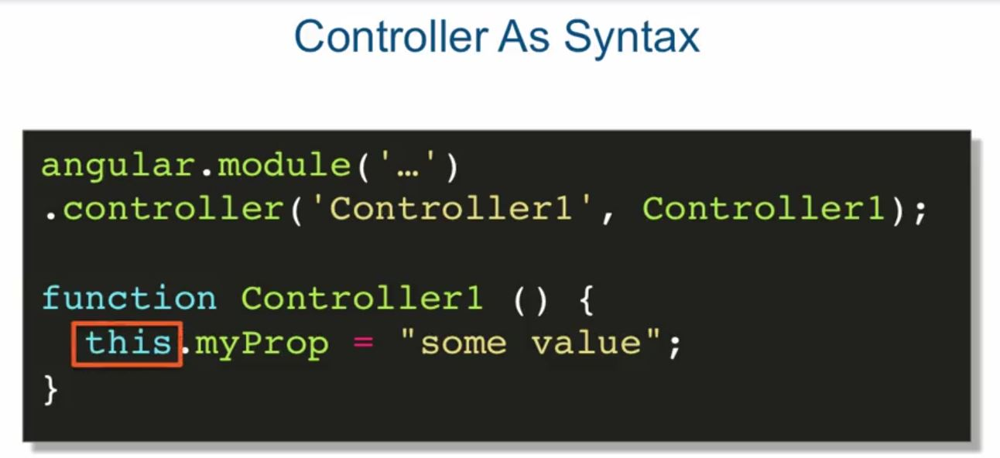
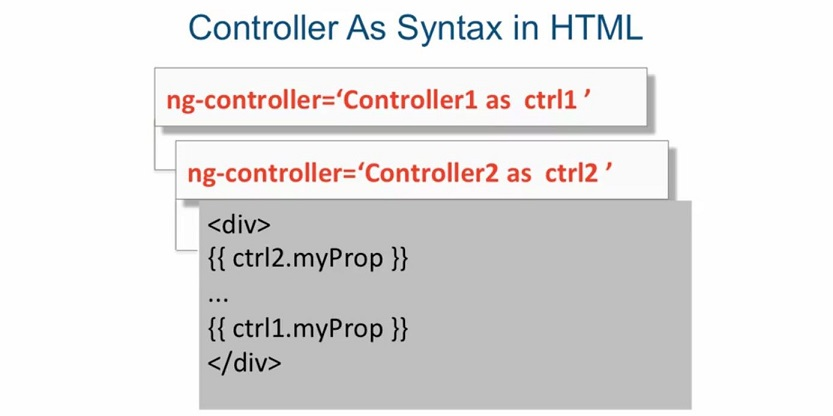
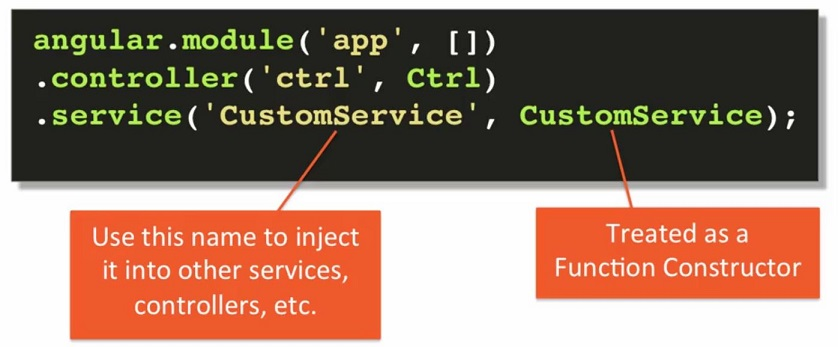
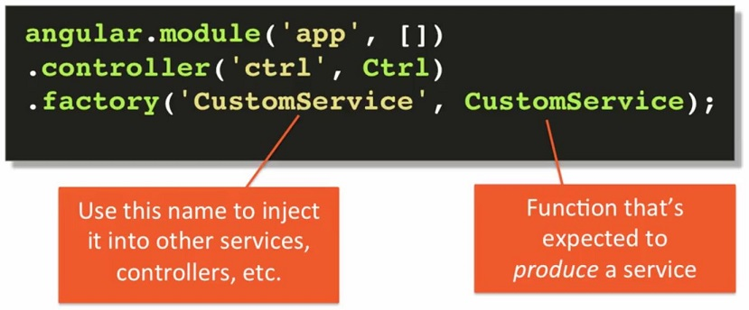

# setup enviroment
- browser
- code editor, e.g. sublime
- git  (check existence: command line> git --version)
  - ```git config --global user.email "<email_address>"```
  - ```git config --global user.name "<user_name>"```
  - clone github repo to local
    - ```git clone <repo url>```
  - commit local repo to github:
    - ```git status```
    - ```git add .```
    - ```git commit .m "<message...>"```
    - ```git push```
  
- node.js  (check existence: command line> node --version)
- browser-sync  (check existence: command line> browser-sync --version)
  - ```cmd_line > browser-sync start --server -- directory --files "**/*" ```
- github account

# AngularJS Basics
- high cohesion, loose coupling
  - high cohesion : when smaller pieces of functionality are strongly related to each other within some code boundary. How well does that one thing stick to doing just one thing.
  
  - loose coupling : least possible dependency of one component on another component. If you change one, you do not have to change the other.
    

- MVVM : Model, View, Viewmodel
  - Model: it represents and holds **raw** data.  
    - Some of this data, in some form, may be displayed in the view.
    - Can also contain logic to retrieve the data from some source.
    - Contains **no logic** associated with displaying the model.
    
  - View: user interface that never changes data, declares events  
    - In a web app, it's just the HTML and CSS.
    - Only displays the data that it is given.
    - **Never** changes the data.
    - Declaratively broadcasts events, but **never** handles them.
    
  - View Model: representation of the state of the view.  
    - Holds the data that's displayed in the view.
    - Responds to view events, aka presentation logic.
    - Calls other functionality for business logic processing.
    - **Never** directly asks the view to display anything.
    
  - Declarative Binder : declaratively binds the model of the ViewModel to the View.    
    - _Declaratively_ means you don't have to write any code, the framework does this "magic"
    - Key enabler of the whole MVVM pattern.
    
  Angular is **not** restricted to MVVM.
  In AngularJs, Controller serves the function of ViewModel. (Controller is ViewModel)

- Dependency injection(DI)
  - Design pattern that _implements inversion of control_(IoC) for resolving dependencies.
  - Client gets called with the dependency by some system(e.g. AngularJS)
  - Client is not responsible for instantiating the dependency
  - **Protecting Dependency Injection from Minification**  (week1 Lecture10), two methods:
    
    Original code:
    ```
      (function () {
        'use strict';
        angular.module('DIApp', [])
        .controller('DIController', DIController);
        
        function DIController($scope, $filter) {
          $scope.name = "Yaakov";
          
          $scope.upper = function() {
            var upCase = $filter('uppercase');
            $scope.name = upCase($scope.name);
          };
        }
      })();
    ```    
    
    - Inline array with function as last element
    ```
      (function () {
        'use strict';
        angular.module('DIApp', [])
        .controller('DIController', ['$scope', '$filter', function($scope, $filter) {
          $scope.name = "Yaakov";
          
          $scope.upper = function() {
            var upCase = $filter('uppercase');
            $scope.name = upCase($scope.name);
          };
        }]);
      })();
      
      or
      (function () {
        'use strict';
        angular.module('DIApp', [])
        .controller('DIController', ['$scope', '$filter', DIController]);
       
        function DIController($scope, $filter) {
          $scope.name = "Yaakov";
          
          $scope.upper = function() {
            var upCase = $filter('uppercase');
            $scope.name = upCase($scope.name);
          };
        }
      })();      
    ```
    - Attach $inject property to the function object
    ```
      (function () {
        'use strict';
        angular.module('DIApp', [])
        .controller('DIController', DIController);
        
        DIController.$inject = ['$scope', '$filter'];
        
        function DIController($scope, $filter) {
          $scope.name = "Yaakov";
          
          $scope.upper = function() {
            var upCase = $filter('uppercase');
            $scope.name = upCase($scope.name);
          };
        }
      })();
    ```

- expressions and interpolation
  - Expression : {{exp}}
  
    Something that eveluates to some value
    - Processed by Angular & _roughly_ similar to the result of _eval(some_js)_
    - Executed in the context of the scope & has access to properties on $scope
    - Doesn't throw errors if it results in a TypeError or ReferenceError
    - Control flow functions (e.g., 'if' statements, etc.) are not allowed
    - Accept a filter or a filter chain to format the output
    
  - Interpolation
  
    Process of evaluating a _string literal_ containing one or more placeholders, which are replaced with values. In Angular, these placeholders are usually expressions.
    - In Angular, this string:
      ```
      Message is {{ message }}
      ```
      (provide message = "hello") is interpolated into this string:
      ```      
      Message is hello
      ```
    - Still connected to the original _message_ property. Result is automatically updated when placeholder value changes.
      
      If $scope.message changes, so will the interpolation result.

- [Filters](https://docs.angularjs.org/guide/filter)

  Filters format the value of an expression for display to the user. They can be used in view templates, controllers or services.
  
  Syntax:
  ```
  1) Filters can be applied to expressions in view templates using the following syntax:
  {{ expression | filter }}
  
  2) Filters can be applied to the result of another filter. This is called "chaining" and uses the following syntax:
  {{ expression | filter1 | filter2 | ... }}
  
  3) Filters may have arguments. The syntax for this is
  {{ expression | filter : argument1 : argument2:... }}
  ```
  
  ```
  // example, convert msg to uppercase
  var msg = 'hello';
  var output = $filter('uppercase')(msg);   // output will be 'HELLO'
  
  // if in html:
  {{ 'hello' | uppercase}}
  
  // another example
  {{ 12 | currency }}      // The resulting value is $12.00
  ```
  - [built-in filters](https://docs.angularjs.org/api/ng/filter)
  
    Name | Description  | Usage
    ---- | -------------------------------------------------------- | ---------------------------------------------------
    filter | Selects a subset of items from array and returns it as a new array. | 
    currency | Formats a number as a currency (ie $1,234.56). When no currency symbol is provided, default symbol for current locale is used. | 
    number | Formats a number as text. | 
    date | Formats date to a string based on the requested format. | 
    json | Allows you to convert a JavaScript object into JSON string. | 
    lowercase | Converts string to lowercase. | 
    uppercase | Converts string to uppercase. | 
    limitTo | Creates a new array or string containing only a specified number of elements. The elements are taken from either the beginning or the end of the source array, string or number, as specified by the value and sign (positive or negative) of limit. Other array-like objects are also supported (e.g. array subclasses, NodeLists, jqLite/jQuery collections etc). If a number is used as input, it is converted to a string. | 
    orderBy | Returns an array containing the items from the specified collection, ordered by a comparator function based on the values computed using the expression predicate. | 

  - **Creating custom filters**
  
    Steps:
    - Define filter factory function
    ```
      function CustomFilterFactory() {
        return function (input[,arg1[,arg2..]]) {
          return changeInput;
        };
      }
    ```
    
    - Register filter factory with module
    ```
      angular.module('app', [])
      .controller('ctrl', Ctrl)
      .filter('custom', CustomFilterFactory); 
      // Note: we registered a factory function called 'custom', AngularJs will execute our factory to 
      create the actual filter function and name it 'customFilter'.
    ```
    
    - Use it in html (no need injection to controller)
    ```
      {{ 'hello' | custom [:arg1[:arg2..]] }}    // use it with registered name
    ```    

    - Inject it with _name**Filter**_
    ```
      Ctrl.$inject = ['$scope', 'customFilter'];
      
      function Ctrl($scope, customFilter) {
        var msg = "Some input";
        customFilter(msg[,arg1[,arg2..]]);
      }
    ```

- Digest Cycle
  - Running digest loops until all watchers report that nothing has changed (dirty checking).
  
  
  
  - Several ways to set up _**wathchers**_:
    - $scope.$watch - **don't** do this in a controller
    - {{ someProp }}
    - ```<input... ng-model="someProp">```
  - Only applies to things done inside of the Angular context
    
  
  
  - $digest and $apply
    - Digest cycle does not get triggered automatically if events are unaware of Angular.
    - Solutions:
      - Call _**$digest**_ after your custom code      
      ```
        (function () {
          'use strict';

          angular.module('CounterApp', [])
          .controller('CounterController', CounterController);

          CounterController.$inject = ['$scope'];
          function CounterController($scope) {
            $scope.counter = 0;

            $scope.upCounter = function () {
              setTimeout(function () {
                $scope.counter++;
                console.log("Counter incremented!");
                $scope.$digest();     // make the change aware of Angular
              }, 2000);
            };
          }
        })();
      ```
      
      - Wrap your custom code inside of $apply      
      ```
        (function () {
          'use strict';

          angular.module('CounterApp', [])
          .controller('CounterController', CounterController);

          CounterController.$inject = ['$scope'];
          function CounterController($scope) {
            $scope.counter = 0;

            $scope.upCounter = function () {
              setTimeout(function () {
                $scope.$apply(function () {   // make the change aware of Angular
                  $scope.counter++;
                  console.log("Counter incremented!");                  
                });
              }, 2000);
            };
          }
        })();      
      ```
      
      - Find Angular specific service that handles the same functionality, e.g., $timeout      
      ```
        (function () {
          'use strict';

          angular.module('CounterApp', [])
          .controller('CounterController', CounterController);

          CounterController.$inject = ['$scope', '$timeout'];
          function CounterController($scope, $timeout) {
            $scope.counter = 0;

            $scope.upCounter = function () {
              $timeout(function () {
                $scope.counter++;
                console.log("Counter incremented!");
              }, 2000);
            };
          }
        })();      
      ```

- Data Binding

  2-way binding, 1-way binding, and 1-time binding. 
  - 2-way binding (ng-model) means:
    - Listener for change on input automatically set up by Angular updates prop value on $scope
    - Direct update to prop value is automatically updated in UI
    
  - 1-way binding ({{ prop }}) means:
    - Direct update to prop value is automatically updated in UI
    
  - 1-time binding ({{ ::prop }}) means:
    - Initialized value of prop is automatically updated in UI
    - Watcher for prop is removed, so UI never again gets updated  
  
  Example:
  ```
    Your name:
    <input type = 'text'
           ng-model = "name">            // 2-way binding, input text <===> $scope.name;
    <div> Echo: {{ lastName }} </div>    // 1-way binding,   <=== $scope.lastName;
    <div> Echo: {{ ::fullName }} </div>  // 1-time binding
  ```

- Looping
  - ng-repeat
    - ng-repeat is a directive that extends the functionality of HTML elements it's applied to.
      - behaves very similarly to for-each construct.
    - ng-repeat="item in collection", where item can now be used in interpolation as an item in the collection at particular index of iteration.
    - ng-repeat exposes a special $index property to the body of its host tag.
      - holds the numeric index of the current item in the loop.
  - filtered ng-repeat
    - Angular has a special filter called "filter"
      - Provide a string as 1st argument, it will filter array it's applied to, matching all string items against the provided one.
    - ng-repeat="item in collection | filter : searchString"

- Controller as syntax
  - Prototypal inheritance
  - Scope inheritance
  
    
    
    The scope of the inner controller prototypically inherits from the scope of the outer controller. The properties declared in the outer controller scope, Controller_1, in this case, are accessible to the inner controller scope, Controller_2 and 3, without any extra effort.
  
  - Controller As syntax (Lecture 19: part3)
  
    
    
    
    
- Custom Services (.service() / .factory() / .provider())
  - why to build custom services?
    - Controller's responsibility
      - Use controllers to :
        - Set up initial state of $scope
        - Add behavior to the $scope
      - Do NOT use controllers to :
        - ...
        - Handle business logic directly
        - Share code or state across controllers
        
        _**USE A CUSTOM SERVICE!!!**_
  
  - some related theories
    - Singleton Design Pattern : restricts object to always having a single instance.
      - Each dependent component gets a reference to the same instance
      - Multiple controllers injected with a Service will all have access to the same service instance
    - Lazy Instantiation
      - Only created if application component declares it as a dependency
        - If no components in your application are dependent on this service, it will never get created
  
  - custom services with **.service()**
    - Register Service Function Constructor
      
      
    - Inject service to controller
    ```
      angular.module('ShoppingListApp', [])
      .controller('ShoppingListAddController', ShoppingListAddController)
      .controller('ShoppingListShowController', ShoppingListShowController)
      .service('ShoppingListService', ShoppingListService);
      
      ShoppingListAddController.$inject = ['ShoppingListService'];
      function ShoppingListAddController(ShoppingListService) {
        ...ShoppingListService.prop...
        ...ShoppingListService.method()...
      };
      
      ShoppingListShowController.$inject = ['ShoppingListService'];
      function ShoppingListShowController(ShoppingListService) {
        ...ShoppingListService.prop...
        ...ShoppingListService.method()...
      };
      
      function ShoppingListService([args]) {...};
    ```
  
  - custom services with **.factory()**
    - factory design pattern
      - Can produce any type of object, not just a singleton
      - Can be used to produce dynamically customizable services
      
    - factory vs. service
      - .factory() is **NOT** just another way of creating the same service you can create with .service() but it **CAN BE**.
      - .service() is also a factory, but a much more limited one compared to .factory(). It's a factory that always produces the same type of service - a singleton, without an easy way to configure its behavior. That .service() method is usually used as a shortcut for something that doesn't require any configuration whatsoever.
      
    - Register Service Factory Function (similar with register service)
    

    - Service Factory function (two ways)
      - return function
      ```
        function CustomService() {
          var factory = function() {
            return new SomeService();
          };
          
          return factory;
        }
        
        // usage
        var someSrv = CustomService();
        someSrv.method();
      ```
      
      - return object literal
      ```
        function CustomService() {
          var factory = {
            getSomeService : function() {
              return new SomeService();
            }
          };
          
          return factory;
        }
        
        // usage
        var someSrv = CustomService.getSomeService();
        someSrv.method();
      ```
      
    - Summary
      - .factory() allows us to produce any type of object or function
        - that includes a service (even a singleton), but is NOT limited to 
        - .service() is just a more limited factory
      - .factory('name', factoryFunction) - name is what's injected
      - Injected factory function refers to whatever is returned in the factory function
        - can be object literal with a prop that's a function that creates something
        - can be a function that creates something
      
  - custom services with **.provider()** (Lecture 22)
    - The .provider method is the most verbose, and at the same time, the most flexible method of creating services in Angular. Not only can you create a factory that's dynamically configurable at the time of using the factory, with the provider method, you could custom configure the factory just once at the bootstrapping of your entire application. And then, use that factory throughout your application with your custom settings. In other words, you could configure this factory before your application starts. In fact, as the angular documentation tells us, the provider method is what actually gets executed behind the scenes when we configure our services with either .service or .factory methods.
    
    - Step1: Define provider function
    ```
      function ServiceProvider() {
        var provider = this;
        provider.config = {...};   // provide some config object. usually with defaults.
        
        provider.$get = function () {      // provider.$get is factory function, just like the one provided to .factory()
          var service = new Service(provider.config.prop);
          return service;
        };
      }
    ```
    
    - Step2: Register provider function with Module
    ```
      angular.module('app', [])
      .controller('ctrl', Ctrl)
      .provider('Service', ServiceProvider);  
      // 'Service' is the name of service, as it will be injected into other services, controllers, and so on.
    ```
    
    - Step3: inject
    ```
      Ctrl.$inject = ['$scope', 'Service'];
      
      function Ctrl($scope, Service) {
        Service.someMethod();
      }
    ```
    
    - Step4a (optional): Register Config function
    ```
      angular.module('app', [])
      .controller('ctrl', Ctrl)
      .provider('Service', ServiceProvider)
      .config(Config);     // guaranteed to run before any services, factories, or controllers are created
    ```
    
    - Step4b (optional): inject provider into Config (define Config function)
    ```
      ...
      .provider('Service', ServiceFn);   // registered servce name is 'Service'
      ...
      Config.$inject = ['ServiceProvider'];  // registered service name + 'Provider' ==> 'ServiceProvider'
      function Config('ServiceProvider') {
        ServiceProvider.config.prop = 'value';
      }
    ```
    
    - Summary
      - .provider() - most verbose, but most flexible
        - configure factory not just at time of use, but at app bootstrapping
      - .provider('name', function)
        - whatever the 'name' is - that's what gets injected into other components
      - .config() function gets called before any service, factory, or controller is instatiated
        - therefore, we can't inject any regular components into .config
        - we CAN inject the provider of service with nameProvider
        
- ng-if, ng-show and ng-hide
  ```
    <div ng-if = 'list.errorMessage' class = 'error'> Error: {{list.errorMessage}}</div>    
    <div ng-show = 'list.errorMessage' class = 'error'> Error: {{list.errorMessage}}</div> 
    <div ng-hide = '!list.errorMessage' class = 'error'> Error: {{list.errorMessage}}</div>
  ```
  - ng-if is a general purpose "if statement" like attribute directive
    - if its value is false, angular removes the containing element from the DOM entirely
  - ng-show / ng-hide attribute directives automatically attach CSS classes to the containing element that either show or hide the element
    - the containing element does NOT get removed from the DOM
