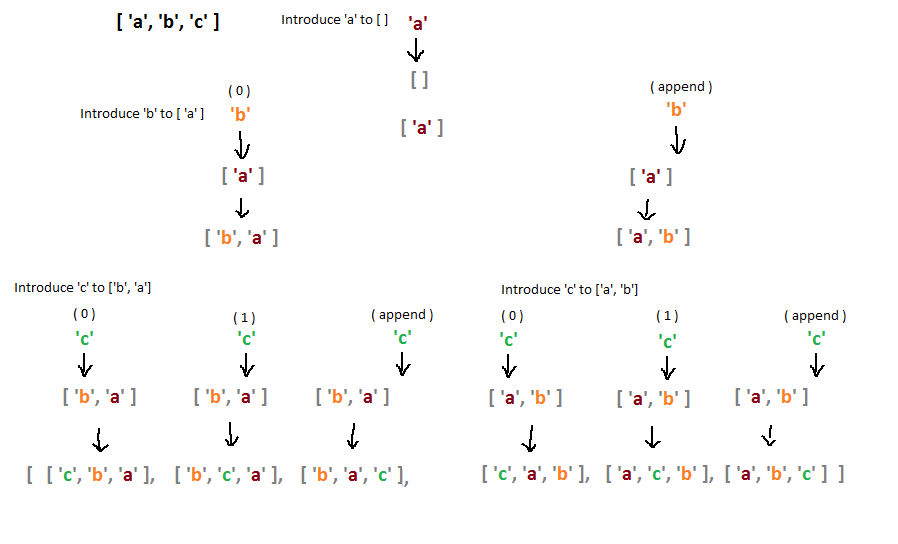

# No repeats please

Return the number of total permutations of the provided string that don't have repeated consecutive letters. Assume that all characters in the provided string are each unique.

For example, aab should return 2 because it has 6 total permutations (aab, aab, aba, aba, baa, baa), but only 2 of them (aba and aba) don't have the same letter (in this case a) repeating.

## permutation-generating algorithm
### Straight Forward Method
Here's a diagram illustrating the idea:


Code for this idea:
```JavaScript
var permute = function(char, str) {
  var perm = [];
  var strArr = str.split('');
  for (var i = 0; i <= strArr.length; i++) {
    strArr.splice(i,0,char);
    perm.push(strArr.join(''));
    strArr.splice(i,1);
  }
  return perm;
}

function permAlone(str) {
  var strArr = str.split('');  
  var perm = strArr.reduce(function(acc, char) {
    var result = [];
    for (var i in acc) {
      Array.prototype.push.apply(result, permute(char, acc[i]));
    }
    return result;
  }, ['']);
  
  return perm;
}

// test case
permAlone('abc');     //['cba','bca','bac','cab','acb','abc']
```
#### Or in two-dimension array:
```Javascript
var permute = function(char, arr) {
  var perm, dest = [];
  for (var i = 0; i <= arr.length; i++) {
    perm = arr.slice(0);
    perm.splice(i,0,char);
    dest.push(perm);
  }
  return dest;
}

function permAlone(str) {
  var strArr = str.split('');  
  var perm = strArr.reduce(function(acc, char) {
    var result = [];
    for (var i in acc) {
      Array.prototype.push.apply(result, permute(char, acc[i]));
    }
    return result;
  }, [[]]);
  
  return perm;
}

// test case
permAlone('abc');  //[['c','b','a'],['b','c','a'],['b','a','c'],['c','a','b'],['a','c','b'],['a','b','c']]
```


### Heap's algorithm


## Solution Code
### Straight forward one
```Javascript
function permAlone(str) {
  // Create a regex to match repeated consecutive characters.
  var regex = /(.)\1+/g;
  
  // Return 0 if str contains all the same character.
  if (str.match(regex) !== null && str.match(regex)[0] === str) return 0;
  
  var strArr = str.split('');  
  
  var permute = function(char, arr) {
    var perm, dest = [];
    for (var i = 0; i <= arr.length; i++) {
      perm = arr.slice(0);
      perm.splice(i,0,char);
      dest.push(perm);
    }
    return dest;
  };
  
  var perm = strArr.reduce(function(acc, char) {
    var result = [];
    for (var i in acc) {
      Array.prototype.push.apply(result, permute(char, acc[i]));
    }
    return result;
  }, [[]]);
  
  var num = perm.reduce(function(rst, arr) {
    if (arr.join('').match(regex) === null) {
      rst++;
    }
    return rst;
  }, 0);

  return num;
}

// test case
permAlone('aab');   // 2
```

# Related Knowledge
- [Definition of Permutations](https://www.mathsisfun.com/combinatorics/combinations-permutations.html)
- permutation-generating algorithm, [Heap's algorithm](https://en.wikipedia.org/wiki/Heap%27s_algorithm)
- Regular Expression
- Array methods
  - [Array.prototype.slice()](https://developer.mozilla.org/en-US/docs/Web/JavaScript/Reference/Global_Objects/Array/slice)
    - The slice() method returns **a shallow copy** of a portion of an array into a new array object selected from begin to end (end not included). The original array will not be modified.
    - Syntax
    ```
    arr.slice()               // slice begins from index 0
    arr.slice(begin)          // slice begins from index 'begin'. if it's negative, relative to end.
    arr.slice(begin, end)     // up to end, but not including it.
    ```
  - [Array.prototype.splice()](https://developer.mozilla.org/en-US/docs/Web/JavaScript/Reference/Global_Objects/Array/splice)
    - The splice() method changes the content of an array by removing existing elements and/or adding new elements.
    - Syntax
    ```
    array.splice(start)
    array.splice(start, deleteCount)
    array.splice(start, deleteCount, item1, item2, ...)
    ```
  - Combination usage of splice() and slice() example:
    ```
    var arr = ['a', 'b', 'c'];
    for (var i = 0; i <= arr.length; i++) {
        arr.splice(i, 0, "d");
        console.log(arr);
        arr.splice(i, 1);
    }

    the log output will be: 
      ['d', 'a', 'b', 'c'] 
      ['a', 'd', 'b', 'c'] 
      ['a', 'b', 'd', 'c'] 
      ['a', 'b', 'c', 'd']
    ```

# Reference solution
- FCC [Algorithm No Repeats Please](https://github.com/FreeCodeCamp/FreeCodeCamp/wiki/Algorithm-No-Repeats-Please)
