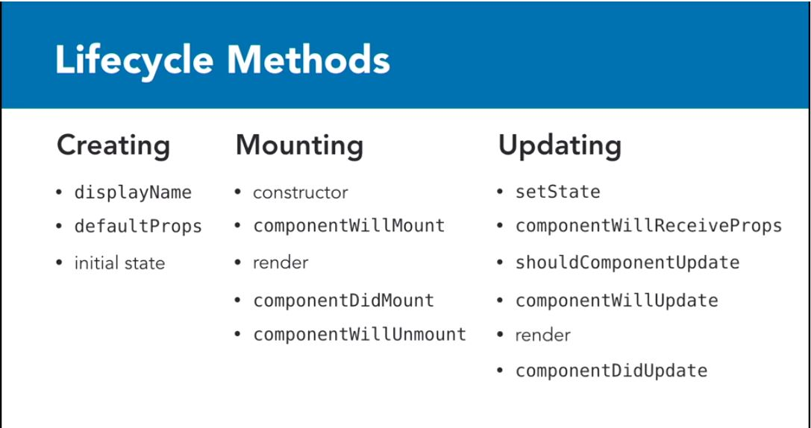

# data visualizaition verification

## 1. Sass

## 2. React
### 2.1 Env setup
#### 2.1.1 use [webpack](https://webpack.js.org/)
- Install dependencies
  ```
  > npm init -y
  > touch webpack.config.js      // create webpack config file
  > npm install --save-dev webpack@1 webpack-dev-server@1
  ```
- Setup webpack development server
  
  check latest config options [here](https://webpack.js.org/configuration/)
  
  ```
  // webpack.config.js
  module.exports = {
    entry: './source/client.js',          // the entry file of your App
    output: {
      path: './public',                   // the directory of compiled file
      filename: 'index.js'                // the compiled file name
    },
    devServer: {
      inline: true,                       // automatically recompile and refresh on change
      contentBase: './public',            // web root
      port: 3000                          // server port
    }
  }
  
  // package.json
  {
    ...
    "main": "index.js"
    "scripts": {
      "start": "webpack-dev-server"
    },
    ...
  }
  ```
  then run : `> npm start` , will compile/start server/watch modification and recompile/refresh.

#### 2.1.2 Dev in ES6 with [Babel](http://babeljs.io/)
- Install dependencies
  ```
  npm install --save-dev babel-preset-es2015    // babel preset, translate ES6 to ES5
                         babel-loader           // a loader module used by webpack
  ```
- Config webpack.config.js
  ```
  module.exports = {
    ...,
    module: {
      loaders: [
        {
          test: /\.js$/,
          loader: 'babel',
          query: {
            cacheDirectory: true,
            presets: ['es2015']
          }
        }
      ]
    }
  }
  ```
  
#### 2.1.3 JSX
JSX is a preprocessor step that adds XML syntax to JavaScript. You can definitely use React without JSX but JSX makes React a lot more elegant.
##### 2.1.3.1 JSX in webpack with Babel
- Install dependencies
  ```
  npm install --save-dev babel-preset-react
  npm install --save babel-polyfill         // for old browser which not support ES5
  npm install --save react react-dom
  ```
  
- modify webpack.config.js
  ```
  module.exports = {
    entry: ['babel-polyfill', './source/client.js'],
    ...
    module: {
      loaders : [
        {
          ...,
          query: {
             ...,
             presets : ['es2015', 'react']
          }
        }
      ]
    }
  }
  ```
  
- A simple example of using JSX
  ```javascript
  // client.js
  import React from 'react';
  import ReactdOM from 'react-dom';
  
  function hey(from='Ben', to='you') {
    return `Hello from ${from} to ${to}.`;
  }
  
  ReactDOM.render(
    <div>Hello from inside here.</div>,
    getElementById('app')
  );
  ```

##### 2.1.3.2 [JSX in-depth](https://facebook.github.io/react/docs/jsx-in-depth.html)

### 2.2 React Basics
#### 2.2.1 [Use Composition instead of Inheritance](https://facebook.github.io/react/docs/composition-vs-inheritance.html)
- Example
```javascript
  function FancyBorder(props) {
    return (
      <div className={'FancyBorder FancyBorder-' + props.color}>
        {props.children}
      </div>
    );
  }

  function WelcomeDialog() {
    return (
      <FancyBorder color="blue">
        <h1 className="Dialog-title">
          Welcome
        </h1>
        <p className="Dialog-message">
          Thank you for visiting our spacecraft!
        </p>
      </FancyBorder>
    );
  }
```

#### 2.2.2 [Typechecking With PropTypes](https://facebook.github.io/react/docs/typechecking-with-proptypes.html)
- Example
  ```javascript
  import PropTypes from 'prop-types';

  class Greeting extends React.Component {
    render() {
      return (
        <h1>Hello, {this.props.name}</h1>
      );
    }
  }

  Greeting.propTypes = {
    name: PropTypes.string
  };
  ```
  
- Default Prop Values
  ```javascript
  class Greeting extends React.Component {
    render() {
      return (
        <h1>Hello, {this.props.name}</h1>
      );
    }
  }

  // Specifies the default values for props:
  Greeting.defaultProps = {
    name: 'Stranger'
  };

  // Renders "Hello, Stranger":
  ReactDOM.render(
    <Greeting />,
    document.getElementById('example')
  );
  ```
  
#### 2.2.3 React lifecycle

  In an ideal world, we wouldn’t use lifecycle methods. All our rendering issues would be controlled via state and props.
But it’s not an ideal world, and sometimes you need to exact a little more control over how and when your component is updating.

  
  
  method | Most Common Use Case | Can call setState
  ------ | -------------------- | ----------------------------
  componentWillMount | App configuration in your root component | Don’t. Use default state instead.
  componentDidMount | Starting AJAX calls to load in data for your component | Yes
  componentWillReceiveProps | Acting on particular prop changes to trigger state transitions. we have access to both the next props (via nextProps), and current props (via this.props). `componentWillReceiveProps(nextProps) {...}` | Yes
  shouldComponentUpdate | Controlling exactly when your component will re-render. `shouldComponentUpdate(nextProps, nextState)` | No
  componentWillUpdate | Used instead of componentWillReceiveProps on a component that also has shouldComponentUpdate (but no access to previous props). | No
  componentDidUpdate | Updating the DOM in response to prop or state changes. | Yes
  componentWillUnmount | Cleaning up any leftover debris from your component. | No
  

- [React Lifecycle Methods- how and when to use them](https://engineering.musefind.com/react-lifecycle-methods-how-and-when-to-use-them-2111a1b692b1)

- [React: Lifecycles](https://www.lynda.com/React-js-tutorials/React-Lifecycles/592509-2.html)
  
#### 2.2.4 React Router
- [A Simple React Router v4 Tutorial](https://medium.com/@pshrmn/a-simple-react-router-v4-tutorial-7f23ff27adf)
  
#### 2.2.5 AJAX in React

- [How to make AJAX requests in React?](https://medium.com/@baphemot/how-to-make-ajax-requests-in-react-a6a52bb5a8b1)
- [5 best libraries for making AJAX calls in React](https://hashnode.com/post/5-best-libraries-for-making-ajax-calls-in-react-cis8x5f7k0jl7th53z68s41k1)
- [react-ajax-best-practices](http://andrewhfarmer.com/react-ajax-best-practices/)

### 2.3 [Redux](http://redux.js.org/)
#### 2.3.1 Data flow


- strict _**unidirectional**_ data flow
- The data lifecycle in any Redux app follows these 4 steps:

  - You call `store.dispatch(action)`.  
  
    You can call `store.dispatch(action)` from anywhere in your app, including components and XHR callbacks, or even at scheduled intervals.
    
  - The Redux store calls the reducer function you gave it.
  
    The store will pass two arguments to the reducer: the current state tree and the action.
    
  - The root reducer may combine the output of multiple reducers into a single state tree.
  
  - The Redux store saves the complete state tree returned by the root reducer.
  
    This new tree is now the next state of your app! Every listener registered with `store.subscribe(listener)` will now be invoked; listeners may call `store.getState()` to get the current state. Now, the UI can be updated to reflect the new state. 
    

#### 2.3.2 Three principles

- Redux can be described in three fundamental principles:
  - **Single source of truth**

    The state of your whole application is stored in an object tree within a _**single store**_.
    
    In Redux, _**all the application state is stored as a single object**_. It's a good idea to think of its shape before writing any code. What's the minimal representation of your app's state as an object?

  - **State is read-only**

    The only way to change the state is to emit an _**action**_, an object describing what happened.
    
    *[Avoid Array mutations with concat(), slice() and ...spread]*(https://egghead.io/lessons/javascript-redux-avoiding-array-mutations-with-concat-slice-and-spread)
    
    *[Avoid Object mutations witch Object.assign() and ...spread]*(https://egghead.io/lessons/javascript-redux-avoiding-object-mutations-with-object-assign-and-spread)

  - **Changes are made with pure functions**

    To specify how the state tree is transformed by actions, you write _**pure reducers**_.

#### 2.3.3 Redux Basics 
##### 2.3.3.1 Actions
- Actions are _**payloads of information**_ that send data from your application to your store. They are the only source of information for the store. You send them to the store using `store.dispatch()`.

- Actions are plain JavaScript objects. Actions must have a type property that indicates the type of action being performed. Types should typically be defined as string constants.

  ```
  const ADD_TODO = 'ADD_TODO'
  {
    type: ADD_TODO,
    text: 'Build my first Redux app'
  }
  ```
  
- **Action creators** are exactly that—functions that create actions.
  ```
  function addTodo(text) {
    return {
      type: ADD_TODO,
      text
    }
  }
  ```

- Example code : actions.js
  ```
  /*
   * action types
   */

  export const ADD_TODO = 'ADD_TODO'
  export const TOGGLE_TODO = 'TOGGLE_TODO'
  export const SET_VISIBILITY_FILTER = 'SET_VISIBILITY_FILTER'

  /*
   * other constants
   */

  export const VisibilityFilters = {
    SHOW_ALL: 'SHOW_ALL',
    SHOW_COMPLETED: 'SHOW_COMPLETED',
    SHOW_ACTIVE: 'SHOW_ACTIVE'
  }

  /*
   * action creators
   */

  export function addTodo(text) {
    return { type: ADD_TODO, text }
  }

  export function toggleTodo(index) {
    return { type: TOGGLE_TODO, index }
  }

  export function setVisibilityFilter(filter) {
    return { type: SET_VISIBILITY_FILTER, filter }
  }  
  ```

##### 2.3.3.2 Reducers
- Reducers specify how the application's state changes in response to actions.
- The reducer is a _**pure function**_ that takes the previous state and an action, and returns the next state.
  ```
  (previousState, action) => newState
  ```
- Things you should _**never**_ do inside a reducer:
  - Mutate its arguments;
  - Perform side effects like API calls and routing transitions;
  - Call non-pure functions, e.g. Date.now() or Math.random().

- Example code : reducer.js
```
  import { combineReducers } from 'redux'
  import {
    ADD_TODO,
    TOGGLE_TODO,
    SET_VISIBILITY_FILTER,
    VisibilityFilters
  } from './actions'
  const { SHOW_ALL } = VisibilityFilters

  function visibilityFilter(state = SHOW_ALL, action) {
    switch (action.type) {
      case SET_VISIBILITY_FILTER:
        return action.filter
      default:
        return state
    }
  }

  function todos(state = [], action) {
    switch (action.type) {
      case ADD_TODO:
        return [
          ...state,
          {
            text: action.text,
            completed: false
          }
        ]
      case TOGGLE_TODO:
        return state.map((todo, index) => {
          if (index === action.index) {
            return Object.assign({}, todo, {
              completed: !todo.completed
            })
          }
          return todo
        })
      default:
        return state
    }
  }

  const todoApp = combineReducers({
    visibilityFilter,
    todos
  })

  export default todoApp
```

  - Each of these reducers is managing its own part of the global state. The state parameter is different for every reducer, and corresponds to the part of the state it manages.
  
  - `combineReducers()` 
    When you emit an action, todoApp returned by combineReducers will call both reducers, it will then combine both sets of results into a single state tree.

##### 2.3.3.3 Store
- Redux store holds the state and takes care of calling your reducer when you dispatch an action.
- You'll only have a single store in a Redux application.
- The store has the following responsibilities:
  - Holds application state;
  - Allows access to state via _**getState()**_;
  - Allows state to be updated via _**dispatch(action)**_;
  - Registers listeners via _**subscribe(listener)**_;
  - Handles unregistering of listeners via the function returned by subscribe(listener).

- `createStore()` 

  ```
  import { createStore } from 'redux'
  import todoApp from './reducers'
  let store = createStore(todoApp)  
  ```
  
  You may optionally specify the initial state as the second argument to createStore(). This is useful for hydrating the state of the client to match the state of a Redux application running on the server.
  ```
  let store = createStore(todoApp, window.STATE_FROM_SERVER)
  ```
  
#### 2.3.4 Redux Usage with React
##### 2.3.4.1 Installing React Redux
```
npm install --save react-redux
```

##### 2.3.4.2 Presentational and Container Components
React bindings for Redux embrace the idea of [_**separating presentational and container components**_](https://medium.com/@dan_abramov/smart-and-dumb-components-7ca2f9a7c7d0).

   items  | Presentational Components | Container Components
--------- | ------------------------- | ---------------------------------          
Purpose | How things **look** (markup, styles) | How things **work** (data fetching, state updates)
Aware of Redux | No | Yes
To read data | Read data from props |	Subscribe to Redux state
To change data | Invoke callbacks from props | Dispatch Redux actions
Are written |	By hand |	Usually generated by React Redux

##### 2.3.4.3 Designing Component Hierarchy
- Designing Presentational Components

  They describe the look but don't know where the data comes from, or how to change it. They only render what's given to them. If you migrate from Redux to something else, you'll be able to keep all these components exactly the same. They have no dependency on Redux.

- Designing Container Components

  We will also need some container components to connect the presentational components to Redux.
  
  Technically, a container component is just a React component that uses `store.subscribe()` to read a part of the Redux state tree and supply props to a presentational component it renders. You could write a container component by hand, but we suggest instead generating container components with the React Redux library's _**`connect()`**_ function, which provides many useful optimizations to prevent unnecessary re-renders.
  
- Designing Other Components

  Sometimes it's hard to tell if some component should be a presentational component or a container. It's fine to mix presentation and logic in a component that is very small. As it grows, it will be more obvious how to split it, so we'll leave it mixed.

##### 2.3.4.4 Implementing Components
- Implementing Presentational Components
  
  Examples:
  ```
  // components/Todo.js
  import React from 'react'
  import PropTypes from 'prop-types'

  const Todo = ({ onClick, completed, text }) => (
    <li
      onClick={onClick}
      style={{
        textDecoration: completed ? 'line-through' : 'none'
      }}
    >
      {text}
    </li>
  )

  Todo.propTypes = {
    onClick: PropTypes.func.isRequired,
    completed: PropTypes.bool.isRequired,
    text: PropTypes.string.isRequired
  }

  export default Todo
  
  /**************************************************************************/
  
  // components/TodoList.js
  import React from 'react'
  import PropTypes from 'prop-types'
  import Todo from './Todo'

  const TodoList = ({ todos, onTodoClick }) => (
    <ul>
      {todos.map(todo => (
        <Todo key={todo.id} {...todo} onClick={() => onTodoClick(todo.id)} />
      ))}
    </ul>
  )

  TodoList.propTypes = {
    todos: PropTypes.arrayOf(
      PropTypes.shape({
        id: PropTypes.number.isRequired,
        completed: PropTypes.bool.isRequired,
        text: PropTypes.string.isRequired
      }).isRequired
    ).isRequired,
    onTodoClick: PropTypes.func.isRequired
  }

  export default TodoList
  
  /**************************************************************************/
  ```
  
- Implementing Container Components  

  To use _**`connect()`**_, you need to define a special function called _**`mapStateToProps`**_ that tells how to transform the current Redux _**store state**_ into the props you want to pass to a presentational component you are wrapping.
  
  In addition to reading the state, container components can _**dispatch actions**_. In a similar fashion, you can define a function called _**`mapDispatchToProps()`**_ that receives the dispatch() method and returns callback props that you want to inject into the presentational component.  
  
  Example : 
  ```
  const getVisibleTodos = (todos, filter) => {
    switch (filter) {
      case 'SHOW_ALL':
        return todos
      case 'SHOW_COMPLETED':
        return todos.filter(t => t.completed)
      case 'SHOW_ACTIVE':
        return todos.filter(t => !t.completed)
    }
  }

  const mapStateToProps = state => {
    return {
      todos: getVisibleTodos(state.todos, state.visibilityFilter)
    }
  }  
  
  const mapDispatchToProps = dispatch => {
    return {
      onTodoClick: id => {
        dispatch(toggleTodo(id))
      }
    }
  }
  
  import { connect } from 'react-redux'
  const VisibleTodoList = connect(
    mapStateToProps,
    mapDispatchToProps
  )(TodoList)

  export default VisibleTodoList  
  ```

- Implementing Other Components

- Passing the Store

  To use a special React Redux component called _**`<Provider>`**_ to magically make the store available to all container components in the application without passing it explicitly. You only need to use it once when you render the root component.
  
  ```
  import React from 'react'
  import { render } from 'react-dom'
  import { Provider } from 'react-redux'
  import { createStore } from 'redux'
  import todoApp from './reducers'
  import App from './components/App'

  let store = createStore(todoApp)

  render(
    <Provider store={store}>
      <App />
    </Provider>,
    document.getElementById('root')
  )
  ```

##### 2.3.4.5 [Example: Todo List](http://redux.js.org/docs/basics/ExampleTodoList.html)
- How Redux works
  - Design **actions**
    What happens? What data you can get through this happening? 

    Design action creators like this:
    ```
    function action_name(data) {
      return {
        type : xxx,
        payload : data
      }
    }
    ```

  - Design **reducers**
    - design state object shape : initialState
    - design reducers : different reducer manages different data domain of state
    - combineReducers

  - Create **store**
    ```
    let store = createStore(root_reducer)
    ```
    The store will pass two arguments to the reducer: the current state tree and the action.

  - Data flow
    - Dispatch actions (something happens)
      ```
      store.dispatch(action)
      ```
    - Redux store 
      - Redux store calls reducer
      - root reducer combine the output of multiple reducers into a single state tree
      - Redux store saves the complete state tree returned by the root reducer
      
- How Redux connect to React App
  - we need react-redux
  
  - use `connect()` do `store.subscribe(listener)`
    - define function `mapStateToProps`, transform Redux store state to componenet props
    - define function `mapDispatchToProps()`, inject callback props to component which will dispatch actions
    - `const container = connect(mapStateToProps, mapDispatchToProps)(component)`
    
  - provide store to container component
  
    All container components need access to the Redux store so they can subscribe to it.
    
    `Provider` makes the store available to all container components in the application without passing it explicitly.
    ```
    <Provider store={store}>
      <Container_component1 />
      <Container_component2 />
    </Provider>
    ```
    

#### 2.3.5 References
- [Redux’s Mysterious Connect Function](https://medium.com/mofed/reduxs-mysterious-connect-function-526efe1122e4)

### 2.4 React Drag-And-Drop
- [react-dnd](https://github.com/react-dnd/react-dnd)
- [HTML Drag and Drop API](https://developer.mozilla.org/en-US/docs/Web/API/HTML_Drag_and_Drop_API)

## 3. D3
