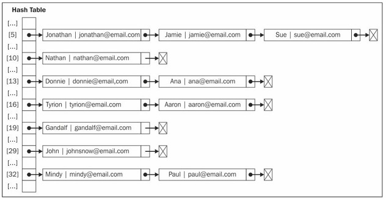
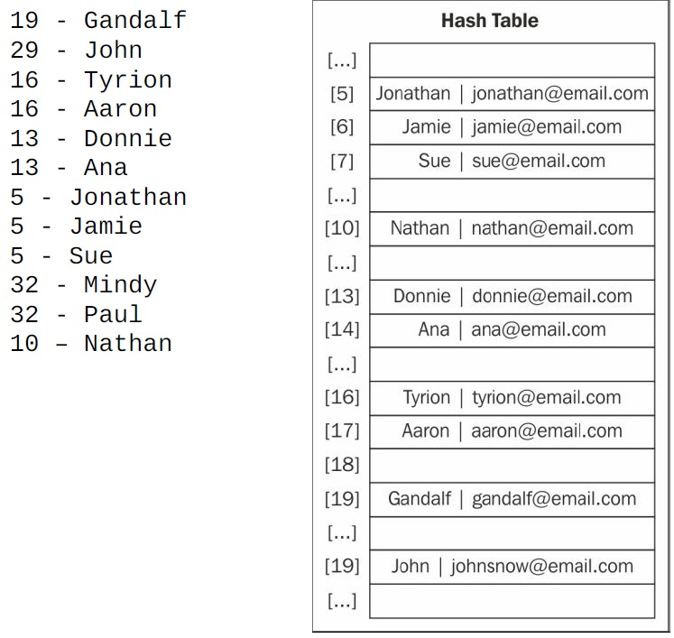
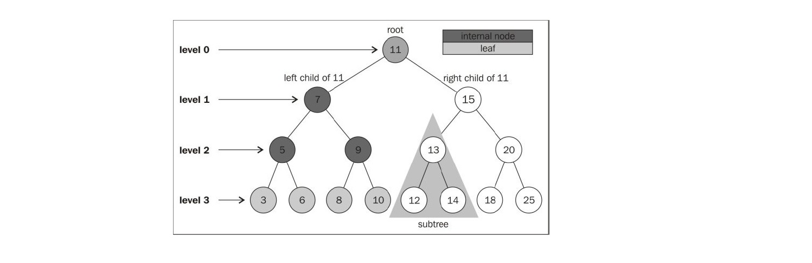
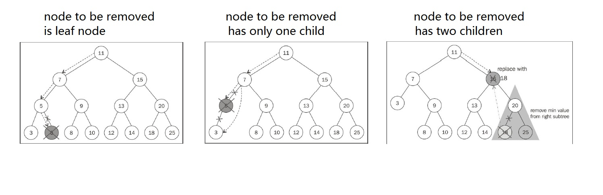
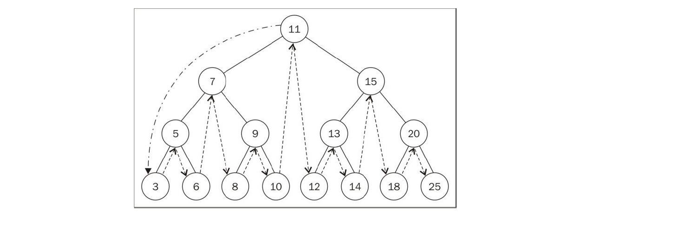
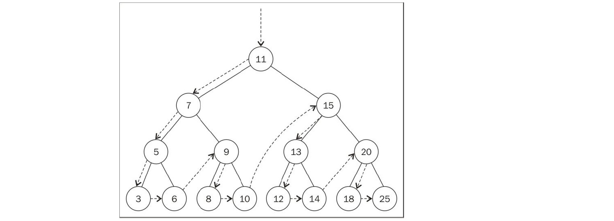
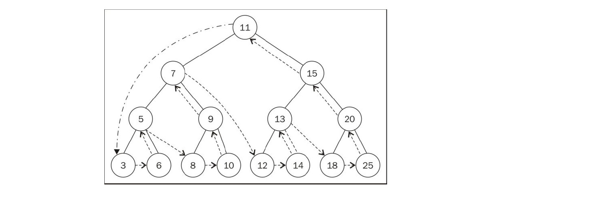

# Data Structures & Algorithms with JavaScript

# Sequential data structures
- ## 1. Arrays and Lists: the most common data structures
  ### 1.1 Array  ([array methods](http://www.w3schools.com/js/js_array_methods.asp))
  - native to Javascript
  - good for _**random access**_
  
  - A JavaScript array is actually a specialized type of JavaScript object, with the _**indices being property names**_ that can be integers used to represent offsets. However, when integers are used for indices, they are _**converted to strings**_ internally in order to conform to the requirements for JavaScript objects.
  
  - shallow copy vs. deep copy
  When you assign one array to another array, you are assigning a reference to the assigned array. When you make a change to the original array, that change is reflected in the other array as well. It's called _**shallow copy**_. Example:
    ```
    var nums = [];
    for (var i = 0; i < 100; ++i) {
    nums[i] = i+1;
    }
    var samenums = nums;
    nums[0] = 400;
    print(samenums[0]); // displays 400
    ```
    _**Deep copy**_: each of the original array’s elements is actually copied to the new array’s elements.
    ```
    function copy(arr1, arr2) {
    for (var i = 0; i < arr1.length; ++i) {
        arr2[i] = arr1[i];
      }
    }
    ```

  #### References for JavaScript array methods
  
    Method | Description
    ------ | ------------
    push  | add new elements to the end of the array
    pop | remove an elements from the end of the array
    shift | add new elements to the beginning of the array
    unshift | remove an elements from the beginning of the array
    indexOf | Searches the array for specific elements and returns its position
    lastIndexOf | Returns the last item in the array that matches the search criteria and returns its position
    join | Joins all the array elements into a string
    toString | Returns the array as a string
    concat | Joins multiple arrays and returns a copy of the joined arrays
    splice | add or remove elements from any particular position of array
    slice | Returns a new array from the specified index  
    forEach | Executes a specific function on each element of the array  
    every | Calls a function for every element of the array until false is returned
    some | Passes each element through the supplied function until true is returned
    reduce | reduces the array to a single value
    map | Creates a new array with the result of calling the specified function on each element of the array  
    filter | Creates an array with each element that evaluates to true in the function provided
    sort | Sorts the array alphabetically or by the supplied function
    reverse | Reverses the array so the last items become the first and vice versa  
    valueOf | Like the method toString, this returns the array as a string
  
  ##### Methods details
  - Searching for a Value : indexOf() , lastIndexOf()
    ```Javascript
    arr.indexOf(element);
    arr.lastIndexOf(element);
    ```
  
  - String Representations of Arrays : join() , toString()
    ```Javascript
    arr.join();
    arr.toString();
    ```
    Both functions return a string containing the elements of the array delimited by commas.
    When you do ```console.log(arr)```, it automatically calls the toString() function for that array.
    
  - Creating New Arrays from Existing Arrays : concat() , splice().
    - concat() allows you to put together two or more arrays to create a new array.
    ```Javascript
    var cis = ["Mike", "Clayton", "Terrill", "Danny", "Jennifer"];
    var dmp = ["Raymond", "Cynthia", "Bryan"];
    var itDiv1 = cis.concat(dmp);      // ["Mike", "Clayton", "Terrill", "Danny", "Jennifer", "Raymond", "Cynthia", "Bryan"]
    var itDiv2 = dmp.concat(cisDept);  // ["Raymond", "Cynthia", "Bryan", "Mike", "Clayton", "Terrill", "Danny", "Jennifer"]
    ```
    - splice() allows you to create a new array from a subset of an existing array.
    ```Javascript
    arr.splice(startIndex, length);
    
    var itDiv = ["Mike","Clayton","Terrill","Raymond","Cynthia","Danny","Jennifer"];
    var dmpDept = itDiv.splice(3,3);
    console.log(dmpDept);  // ["Raymond", "Cynthia", "Danny"]
    console.log(itDiv);    // ["Mike", "Clayton", "Terrill", "Jennifer"]
    ```
    
  - Mutator Functions
  
    JavaScript has a set of mutator functions that allow you to modify the contents of an array without referencing the individual elements.  
    - Adding Elements to an Array from end or beginning : push() / shift()
    - Removing Elements from an Array from end or beginning : pop() / unshift()
    - Adding and Removing Elements from the Middle of an Array : splice().
      ```Javascript
      array.splice(start, deleteCount, item1, item2, ...)
      ```
      
    - Putting Array Elements in Order : reverse() , sort()
    
  - Iterator Functions
  
    - Non–Array-Generating Iterator Functions : they do not generate a new array, they either perform an operation on each element of an array or generate a single value from an array.
    
      - forEach() : it takes a function as an argument and applies the called function to each element of an array.
        ```
        arr.forEach(func);
        ```
      - every() : applies a Boolean function to an array and returns true if _**all**_ of the elements in the array meets the criterion of the Boolean function.
      
      - some() : takes a Boolean function and return true if _**at least one**_ of the elements in the array meets the criterion of the Boolean function.
      
      - reduce() : applies a function to an _**accumulator**_ and the successive elements of an array until the end of the array is reached, yielding a single value. for example:
      ```javascript
      function flatten(array) {
        return array.reduce(function(memo, el) {
          var items = Array.isArray(el) ? flatten(el) : el;
          return memo.concat(items);
        }, []);
      }      
      flatten([0, [1,2,3], ["a","b","c"], [4,5], 6]);   // [0, 1, 2, 3, "a", "b", "c", 4, 5, 6]
      ```
      
      - reduceRight() :  works similarly to reduce(), only working _**from the righthand side of the array to the left**_, instead of from left to right.
      
    - Iterator Functions That Return a New Array
      - map() : applying a function to each element of an array, and returns a new array with the results of the function application.
      
      - filter() : applies a Boolean function to an array and returns a new array consisting of those elements that satisfy the Boolean function.
      
  - Sorting : sort() and reverse()

      
  ##### Two-Dimensional and Multidimensional Arrays
  - Processing Two-Dimensional Array Elements : two patterns
    - one pattern emphasizes accessing array elements by columns, columnar processing. The outer loop moves through the rows, and the inner loop processes the columns.
      ```javascript
      var grades = [[89, 77, 78],[76, 82, 81],[91, 94, 89]];
      var total = 0;
      var average = 0.0;
      for (var row = 0; row < grades.length; ++row) {
        for (var col = 0; col < grades[row].length; ++col) {
          console.log(grades[row][col]);  // 89, 77, 78, 76, 82, 81, 91, 94, 89
        }
      }  
      ```
      This pattern has no problem with jagged arrays.
      
    - the other pattern emphasizes accessing array elements by rows. The outer loop moves through the columns, and the inner loop processes the rows.
      ```javascript
      var grades = [[89, 77, 78],[76, 82, 81],[91, 94, 89]];
      var total = 0;
      var average = 0.0;
      for (var col = 0; col < grades.length; ++col) {
        for (var row = 0; row < grades[col].length; ++row) {
          console.log(grades[row][col]);   // 89, 76, 91, 77, 82, 94, 78, 81, 89
        }
      }  
      ```
      **Note**: this pattern may have problem with _**jagged arrays**_.
      
  - Jagged Arrays
    
    A jagged array is an array where the rows in the array may have a different number of elements. for example:
      ```javascript
      arr = [[1,2,3], [4,5], [6,7,8,9,10]];
      ```

  ### 1.2 List
  Lists are especially useful if we _**don’t**_ have to perform searches on the items in the list or put them into some type of sorted order.
  - A List ADT
 
  properties | what it describes
  ---------- | ------------------
  listSize | Number of elements in list
  pos | Current position in list
  length | Returns the number of elements in list
 
  methods | what it describes
  ------- | ------------------
  clear | Clears all elements from list
  toString | Returns string representation of list
  getElement | Returns element at current position
  insert | Inserts new element after existing element
  append | Adds new element to end of list
  remove | Removes element from list
  front | Sets current position to first element of list
  end | Sets current position to last element of list
  prev | Moves current position back one element
  next | Moves current position forward one element
  currPos | Returns the current position in list
  moveTo | Moves the current position to specified position
  
  - A List Class Implementation
    ```javascript
    function List() {
      this.listSize = 0;
      this.pos = 0;
      this.dataStore = []; // initializes an empty array to store list elements
      
      this.clear = clear;
      this.find = find;
      this.toString = toString;
      this.insert = insert;
      this.append = append;
      this.remove = remove;
      this.front = front;
      this.end = end;
      this.prev = prev;
      this.next = next;
      this.length = length;
      this.currPos = currPos;
      this.moveTo = moveTo;
      this.getElement = getElement;
      this.length = length;
      this.contains = contains;
    }
    ```
    
    - Append: Adding an Element to a List
    ```javascript
    function append(element) {
      this.dataStore[this.listSize++] = element;
    }
    ```
    - Find: Finding an Element in a List
    ```javascript
    function find(element) {
      for (var i = 0; i < this.dataStore.length; ++i) {
        if (this.dataStore[i] == element) {
          return i;
        }
      }
      return -1;
    }
    ```
    - Remove: Removing an Element from a List
    ```javascript
    function remove(element) {
      var foundAt = this.find(element);
      if (foundAt > -1) {
        this.dataStore.splice(foundAt,1);
        --this.listSize;
        return true;
      }
      return false;
    }
    ```
    - Length: Determining the Number of Elements in a List
    ```javascript
    function length() {
      return this.listSize;
    }
    ```
    - toString: Retrieving a List’s Elements
    ```javascript
    function toString() {
      return this.dataStore;
    }
    ```
    - Insert: Inserting an Element into a List    
      to insert an element after a specified element already in the list.
    ```javascript
    function insert(element, after) {
      var insertPos = this.find(after);
      if (insertPos > -1) {
        this.dataStore.splice(insertPos+1, 0, element);
        ++this.listSize;
        return true;
      }
      return false;
    }
    ```
    - Clear: Removing All Elements from a List
    ```javascript
    function clear() {
      this.dataStore = [];
      this.listSize = this.pos = 0;
    }
    ```
    - Contains: Determining if a Given Value Is in a List
    ```javascript
    function contains(element) {
      for (var i = 0; i < this.dataStore.length; ++i) {
        if (this.dataStore[i] == element) {
          return true;
        }
      }
      return false;
    }
    ```
    - Traversing a List
    ```javascript
    function front() {
      this.pos = 0;
    }
    
    function end() {
      this.pos = this.listSize-1;
    }
    
    function prev() {
      if (this.pos > 0) {
        --this.pos;
      }
    }
    
    function next() {
      if (this.pos < this.listSize-1) {
        ++this.pos;
      }
    }
    
    function currPos() {
      return this.pos;
    }
    
    function moveTo(position) {
      this.pos = position;
    }
    
    function getElement() {
      return this.dataStore[this.pos];
    }
    ```
  - Iterating Through a List  
    An iterator allows us to traverse a list without referencing the internal storage mechanism of the List class. Some advantages to using iterators over using array indexing include:
    - Not having to worry about the underlying data storage structure when accessing list elements.
    - Being able to update the list and not having to update the iterator, where an index becomes invalid when a new element is added to the list.
    - Providing a uniform means of accessing elements for different types of data stores used in the implemenation of a List class.
    
    here is how to use an iterator to traverse through a list:    
    ```javascript
    for(names.front(); names.currPos() < names.length(); names.next()) {
      print(names.getElement());
    }
    ```
    We can also traverse a list backward using an iterator:
    ```javascript
    for(names.end(); names.currPos() >= 0; names.prev()) {
      print(names.getElement());
    }
    ```
    Iterators are used _**only**_ to move through a list and should not be combined with any functions for adding or removing items from a list.

- ## 2. Stacks and Queues: more complex list-like data structures
  ### 2.1 Stack
  - A stack is a list of elements that are accessible only from one end of the list. One area where stacks are used is in implementing recursion. LIFO.
  - used throughout computer science in both _**compiler and operating system implementations**_.
  - Operations
   
    methods | what does it describe
    ------- | ----------------------
    push | add an element
    pop | take off an element
    peek | returns the value stored at the top of a stack without removing it from the stack.
    clear | removes all the elements from a stack.
    length | holds the number of elements contained in a stack.
    empty | to let us know if a stack has no elements in it.
   
  - Array-based implementation : the Stack class
    ``` javascript
    function Stack() {
      this.dataStore = [];
      this.push = push;
      this.pop = pop;
      this.peek = peek;
      this.clear = clear;
      this.length = length;
      this.empty = empty;
    }

    function push(element) {
      this.dataStore.push(element);
    }

    function pop() {
      return this.dataStore.pop();
    }

    function peek() {
      return this.dataStore[this.dataStore.length - 1];
    }

    function clear() {
      this.dataStore = [];
    }

    function length() {
      return this.dataStore.length;
    }

    function empty() {
      return this.dataStore.length <= 0;
    }
    ```
  
  ### 2.2 Queue
  - A queue is a type of list where data are inserted at the end and are removed from the front. FIFO.
  - Queues are used extensively in simulation software where data has to be _**lined up**_ before it is processed. 
  - Queues are used to order processes submitted to an operating system or a print spooler, and simulation applications use queues to model scenarios such as customers standing in the line at a bank or a grocery store.
  - Operations
   
    methods | what does it describe
    ------- | ----------------------
    enqueue | adds a new element at the end of a queue.
    dequeue | removes an element from the front of a queue.
    clear | remove all the elements from a queue.
    front | returns the element stored at the front of a queue without removing it from the queue.
    back | returns the element stored at the end of a queue without removing it from the queue.
    toString | to display all the elements in a queue.
    empty | if a queue is empty.
    
  - array-based implementation
  ```javascript
  function Queue() {
    this.dataStore = [];
    this.enqueue = enqueue;
    this.dequeue = dequeue;
    this.front = front;
    this.back = back;
    this.toString = toString;
      this.empty = empty;
    }

    function enqueue(element) {
      this.dataStore.push(element);
    }

    function dequeue() {
      return this.dataStore.shift();
    }

    function front() {
      return this.dataStore[0];
    }

    function back() {
      return this.dataStore[this.dataStore.length-1];
    }

    function toString() {
      var retStr = "";
      for (var i = 0; i < this.dataStore.length; ++i) {
        retStr += this.dataStore[i] + "\n";
      }
      return retStr;
    }

    function empty() {
      return (this.dataStore.length == 0);
    }
    ```
  
  - Sorting Data with Queues
    - radix sort
    
  - Priority Queues
    - A priority queue is one where elements are removed from the queue based on a priority constraint.
    - Each element has a "priority" number.
    
    ```Javascript
    function PriorityQueue() {
      var items = [];
      function QueueElement (element, priority){
        this.element = element;
        this.priority = priority;
      }
      
      // enqueue()
      this.enqueue = function(element, priority){
        var queueElement = new QueueElement(element, priority);
        if (this.isEmpty()){
          items.push(queueElement);
        } else {
          var added = false;
          for (var i=0; i<items.length; i++){
            if (queueElement.priority < items[i].priority){   // the smaller the priority number, the higher priority is.
              items.splice(i,0,queueElement);
              added = true;
              break;
            }
          }
          if (!added){ //{5}
           items.push(queueElement);
          }
        }
      };
      
      //other methods - same as default Queue implementation
    }
    ```

  - circular queue – Hot Potato
    ```Javascript
    function hotPotato (nameList, num){
      var queue = new Queue();
      for (var i=0; i<nameList.length; i++){
        queue.enqueue(nameList[i]);
      }
        var eliminated = '';
        while (queue.size() > 1){
        for (var i=0; i<num; i++){
        queue.enqueue(queue.dequeue());
      }
      eliminated = queue.dequeue();
        console.log(eliminated + ' was eliminated from the Hot Potato game.');
      }
      return queue.dequeue();
    }
    ```
  
  
- ## 3. Linked lists: how they overcome the shortcomings of arrays
  - A linked list is a modification of the list data structure, where each element is a separate object linked to the objects on either side of it.
  
  - Linked lists are efficient when you need to perform _**multiple insertions and deletions**_ in your program. Because the most important advantage of a linked list over an array is that you can easily add and remove elements from a linked list without shifting over its elements.
  
  - A linked list is a collection of objects called _**nodes**_. Each node is linked to a successor node in the list using an object reference. The reference to another node is called a _**link**_.
  
  - While array elements are referenced by their position, linked list elements are referenced by their relationship to the other elements of the linked list.
  
  - Linked List ADT
    - Node Object
    
      property | what does it describe
      -------- | ---------------------------------
      element | stores a value.
      next | points to the next node in the list.
    
    - Linked List methods
    
      method | what does it describe
      ------ | --------------------------------
      append(element) | adds a new item to the end of the list.
      insert(position, element) | This inserts a new item at a specified position in the list.
      remove(element) | removes an item from the list.
      removeAt(position) | removes an item from a specified position in the list. if position is invalid, return null; else, remove the node at position and return its data.
      indexOf(element) | returns the index of the element in the list. If the element is not in the list, it returns -1.
      isEmpty() | This returns true if the linked list does not contain any elements and false if the size of the linked list is bigger than 0.
      size() | returns how many elements the linked list contains. It is similar to the length property of the array.
      toString() | As the list uses a Node class as an item, we need to overwrite the default toString method inherited from the JavaScript object to output only the element values.
      getHead() | get the first node of the linked list.
  
  - Implementation
  ```javascript
    function LinkedList() {
      var Node = function(element){
        this.element = element;
        this.next = null;
      };
      var length = 0;
      var head = null;
      
      this.append = function(element){
        var node = new Node(element),
        current;
        if (head === null){ //first node on list
          head = node;
        } else {
          current = head;
          //loop the list until find last item
          while(current.next){
            current = current.next;
          }
          //get last item and assign next to node to make the link
          current.next = node;
        }
        length++; //update size of list     
      };
      
      this.insert = function(position, element){
        //check for out-of-bounds values
        if (position >= 0 && position <= length){
          var node = new Node(element),
          current = head,
          previous,
          index = 0;
          if (position === 0){ //add on first position
            node.next = current;
            head = node;
          } else {
            while (index++ < position){
              previous = current;
              current = current.next;
            }
            node.next = current;
            previous.next = node;
          }
          length++; //update size of list
          return true;
        } else {
          return false;
        }      
      };
      
      this.removeAt = function(position){
        //check for out-of-bounds values
        if (position > -1 && position < length) {
          var current = head,
          previous,
          index = 0;
          //removing first item
          if (position === 0) {
            head = current.next;
          } else {
            while (index++ < position) {
              previous = current;
              current = current.next;
            }
            //link previous with current's next: skip it to remove
            previous.next = current.next;
          }
          length--;
          return current.element;
        } else {
          return null;
        }      
      };
      
      this.remove = function(element){
        var index = this.indexOf(element);
        return this.removeAt(index);      
      };
      
      this.indexOf = function(element){
        var current = head,
        index = -1;
        while (current) {
          index++;
          if (element === current.element) {
            return index;
          }          
          current = current.next;
        }
        return -1;      
      };
      
      this.isEmpty = function() {
        return length === 0;
      };
      
      this.size = function() {
        return length;
      };
      
      this.toString = function(){
        var current = head,
        string = '';
        while (current) {
          string += current.element;
          current = current.next;
        }
        return string;      
      };
      
      this.getHead = function(){
        return head;
      }
    }  
  ```

  - Double linked lists
  
    The doubly linked list provides us with two ways to iterate the list: from the beginning to its end or vice versa. 
    
  ```
    function DoublyLinkedList() {
      var Node = function(element) {
        this.element = element;
        this.next = null;
        this.prev = null; //NEW
      };
      var length = 0;
      var head = null;
      var tail = null; //NEW
      
      //methods here      
    }  
  ```

  - Circular linked lists  
    - the last element’s next (tail.next) pointer does not make a reference to null, but to the first element (head).    
    - And a doubly circular linked list has tail.next pointing to the head element and head.prev pointing to the tail element

# Sets, Dictionaries(maps) and Hashs
  Sets, dictionaries, and hashes store unique values. In a set, we are interested in the value itself as the primary element. In a dictionary (or map), we store values as pairs as [key, value]. The same goes for hashes (they store values as pairs as [key, value]); however, the way that we implement these data structures is a little bit different.

- ## 4. Dictionaries: storing data as key-value pairs
  - store data as key-value pairs.
  - A dictionary is also known as a map
  - MDN [map](https://developer.mozilla.org/en-US/docs/Web/JavaScript/Reference/Global_Objects/Map)
  
  property | description
  -------- | ---------------------------------------------
  Map.prototype.size | Returns the number of key/value pairs in the Map object.
  
  methods | description
  ------- | ----------------------------------------------
  Map.prototype.has(key) | Returns a boolean asserting whether a value has been associated to the key in the Map object or not.
  Map.prototype.get(key) | Returns the value associated to the key, or undefined if there is none.
  Map.prototype.set(key, value) | Sets the value for the key in the Map object. Returns the Map object.
  Map.prototype.delete(key) | Removes any value associated to the key and returns the value that Map.prototype.has(key) would have previously returned. Map.prototype.has(key) will return false afterwards.
  Map.prototype.clear() | Removes all key/value pairs from the Map object.
  Map.prototype.keys() | Returns a new Iterator object that contains the keys for each element in the Map object in insertion order.
  Map.prototype.values() | Returns a new Iterator object that contains the values for each element in the Map object in insertion order.
  Map.prototype.entries() | Returns a new Iterator object that contains an array of [key, value] for each element in the Map object in insertion order.
  Map.prototype.forEach(callbackFn[, thisArg]) | Calls callbackFn once for each key-value pair present in the Map object, in insertion order. If a thisArg parameter is provided to forEach, it will be used as the this value for each callback.
  
    - Iterating Maps with for..of
    ```
      var myMap = new Map();
      myMap.set(0, 'zero');
      myMap.set(1, 'one');
      for (var [key, value] of myMap) {
        console.log(key + ' = ' + value);
      }
      // 0 = zero
      // 1 = one

      for (var key of myMap.keys()) {
        console.log(key);
      }
      // 0
      // 1

      for (var value of myMap.values()) {
        console.log(value);
      }
      // zero
      // one

      for (var [key, value] of myMap.entries()) {
        console.log(key + ' = ' + value);
      }
      // 0 = zero
      // 1 = one    
    ```
    
    - Iterating Maps with forEach()
    ```
      myMap.forEach(function(value, key) {
        console.log(key + ' = ' + value);
      });
      // Will show 2 logs; first with "0 = zero" and second with "1 = one"
    ```
    
    - Relation with Array objects [new Map(arr) / uneval([...map])]
    ```
      var kvArray = [['key1', 'value1'], ['key2', 'value2']];

      // Use the regular Map constructor to transform a 2D key-value Array into a map
      var myMap = new Map(kvArray);

      myMap.get('key1'); // returns "value1"

      // Use the spread operator to transform a map into a 2D key-value Array.
      console.log(uneval([...myMap])); // Will show you exactly the same Array as kvArray

      // Or use the spread operator on the keys or values iterator to get 
      // an array of only the keys or values
      console.log(uneval([...myMap.keys()])); // Will show ["key1", "key2"]    
    ```
    The [uneval()](https://developer.mozilla.org/en-US/docs/Web/JavaScript/Reference/Global_Objects/uneval) function creates a string representation of the source code of an Object.
    
    [... spread operator](https://developer.mozilla.org/en-US/docs/Web/JavaScript/Reference/Operators/Spread_operator)
    
- ## 5. Hashing: good for quick insertion and retrieval

  ### 5.1 Hash Table
  - One way to implement a dictionary is to use a hash table.
  - how to build hash tables and the hash algorithms that are used to store data in the table.
  
  methods | description
  ------- | -----------------------------------------
  put(key,value) | This adds a new item to the hash table (or it can also update it)
  remove(key) | This removes the value from the hash table using the key
  get(key) | This returns a specific value searched by the key  
  
  ```
    function HashTable() {
      var table = [];
      
      var loseloseHashCode = function (key) {
        var hash = 0;
        for (var i = 0; i < key.length; i++) {
          hash += key.charCodeAt(i);
        }
        return hash % 37;
      };
      
      this.put = function (key, value) {
        var position = loseloseHashCode(key);
        console.log(position + ' - ' + key);
        table[position] = value;
      };
      
      this.get = function (key) {
        return table[loseloseHashCode(key)];
      };
      
      this.remove = function(key){
        table[loseloseHashCode (key)] = undefined;
      };      
    }    
  ```
  
  - Handling collisions between hash tables
    - Sometimes, different keys can have the same hash value, we call it a collision.
    - There are a few techniques to handle collisions: separate chaining, linear probing, and double hashing.
      - The *separate chaining* technique consists of creating a linked list for each position of the table and store the elements in it. It is the simplest technique to handle collisions; however, it requires additional memory outside the HashTable instance.
      
      
      ```
        var ValuePair = function(key, value){
          this.key = key;
          this.value = value;
          this.toString = function() {
            return '[' + this.key + ' - ' + this.value + ']';
          }
        };
        
        this.put = function(key, value){
          var position = loseloseHashCode(key);
          if (table[position] == undefined) {
            table[position] = new LinkedList();
          }
          table[position].append(new ValuePair(key, value));
        }; 
        
        this.get = function(key) {
          var position = loseloseHashCode(key);
          if (table[position] !== undefined){
            //iterate linked list to find key/value
            var current = table[position].getHead();
            while(current.next){
              if (current.element.key === key){
                return current.element.value;
              }
              current = current.next;
            }
            //check in case first or last element
            if (current.element.key === key){ 
              return current.element.value;
            }
          }
          return undefined;
        }; 
        
        this.remove = function(key){
          var position = loseloseHashCode(key);
          if (table[position] !== undefined){
            var current = table[position].getHead();
            while(current.next){
              if (current.element.key === key){
                table[position].remove(current.element);
                if (table[position].isEmpty()){ 
                  table[position] = undefined;
                }
                return true;
              }
              current = current.next;
            }
            //check in case first or last element
            if (current.element.key === key){
              table[position].remove(current.element);
              if (table[position].isEmpty()){
                table[position] = undefined;
              }
              return true;
            }
          }
          return false;
        };        
      ```
      
      - Another technique of collision resolution is *linear probing*. When we try to add a new element, if the position index is already occupied, then we try index +1. If index +1 is occupied, then we try index + 2, and so on.
      
      
      ```
        this.put = function(key, value){
          var position = loseloseHashCode(key);
          if (table[position] == undefined) {
            table[position] = new ValuePair(key, value); 
          } else {
            var index = ++position;
            while (table[index] != undefined){
              index++; 
            }
            table[index] = new ValuePair(key, value);
          }
        };
        
        this.get = function(key) {
          var position = loseloseHashCode(key);
          if (table[position] !== undefined){
            if (table[position].key === key) {
              return table[position].value;
            } else {
              var index = ++position;
              while (table[index] === undefined || table[index].key !== key){
                index++;
              }
              if (table[index].key === key) {
                return table[index].value;
              }
            }
          }
          return undefined;
        };
        
        this.remove = function(key) {
          var position = loseloseHashCode(key);
          if (table[position] !== undefined){
            if (table[position].key === key) {
              table[position] = undefined;
            } else {
              var index = ++position;
              while (table[index] === undefined || table[index].key !== key){
                index++;
              }
              if (table[index].key === key) {
                table[index] = undefined;
              }
            }
          }
          return undefined;
        };        
      ```
      
    - Creating better hash functions
    
      A good hash function is composed by some factors: time to insert and retrieve an element (performance) and also a low probability of collisions. For example:
    ```
      var djb2HashCode = function (key) {
        var hash = 5381;
        for (var i = 0; i < key.length; i++) { 
          hash = hash * 33 + key.charCodeAt(i);
        }
        return hash % 1013;
      };    
    ```
    
    reference: [Integer Hash Function](http://web.archive.org/web/20071223173210/http://www.concentric.net/~Ttwang/tech/inthash.htm)

- ## 6. Sets: useful for storing unique elements that appear only once
  - Sets are useful for storing data that is not supposed to have duplicates in the data set.
  - A set is a collection of items that are unordered and consists of unique elements (meaning they cannot be repeated). This data structure uses the same math concept as of finite sets, but applied to a Computer Science data structure.
  - A set with no element is called a null set or empty set.
  - MDN [Set](https://developer.mozilla.org/en-US/docs/Web/JavaScript/Reference/Global_Objects/Set) standard built-in object
  
    methods | description
    ------- | ----------------------------------------
    has(value) | Returns a boolean asserting whether an element is present with the given value in the Set object or not.
    add(value) | Appends a new element with the given value to the Set object. Returns the Set object.
    delete(value) | Removes the element associated to the value and returns the value that Set.prototype.has(value) would have previously returned. Set.prototype.has(value) will return false afterwards.
    clear() | Removes all elements from the Set object.
    entries() | Returns a new Iterator object that contains an array of [value, value] for each element in the Set object, in insertion order. This is kept similar to the Map object, so that each entry has the same value for its key and value here.
    values() | Returns a new Iterator object that contains the values for each element in the Set object in insertion order.
    keys() | Is the same function as the values() function and returns a new Iterator object that contains the values for each element in the Set object in insertion order.
    forEach(callbackFn[, thisArg]) | Calls callbackFn once for each value present in the Set object, in insertion order. If a thisArg parameter is provided to forEach, it will be used as the this value for each callback.
    
  - Implementation (just help understanding)
  ```
    function Set() {
      var items = {};   // using an object to represent the set
    }
    
    this.has = function(value){
      return items.hasOwnProperty(value);
    };
    
    this.add = function(value){
      if (!this.has(value)){
        items[value] = value;    // adding the value as key and value
        return true;   // value added
      }
      return false;    // value not added
    };    
    
    this.remove = function(value){
      if (this.has(value)){
        delete items[value];
        return true;
      }
      return false;
    };  
    
    this.size = function(){
      return Object.keys(items).length;   // Object.keys(obj) returns an array of all properties of a given object.
    };
    
    this.values = function(){
      return Object.keys(items);
    };
  ```

  - basic operations of sets
    - Union (a ∪ b) : Given two sets, this returns a new set with the elements from both given sets.
    ```
      let a = new Set([1,2,3]);
      let b = new Set([4,3,2]);
      let union = new Set([...a, ...b]);    
      // The spread operator (...) inserts the elements of something iterable (like a set) into an array. 
      // Therefore, [...a, ...b] means that a and b are converted to arrays and concatenated. 
      // It is equivalent to [...a].concat([...b]).
    ```
    
    - Intersection (a ∩ b) : Given two sets, this returns a new set with the elements that exist in both sets.
    ```
      let a = new Set([1,2,3]);
      let b = new Set([4,3,2]);
      let intersection = new Set([...a].filter(x => b.has(x)));    
    ```
    
    - Difference (a - b) : Given two sets, this returns a new set with all elements that exist in the first set and do not exist in the second set.
    ```
      let a = new Set([1,2,3]);
      let b = new Set([4,3,2]);
      let difference = new Set([...a].filter(x => !b.has(x)));
    ```
    
    - Subset (A⊆B) : This confirms whether a given set is a subset of another set. For every x (element) that exists in A also exists in B.
    ```
      let a = new Set([1,2,3]);
      let b = new Set([4,3,2]);
      let isSubset = [...a].every(x => b.has(x));
    ```

# Trees
- A tree is an abstract model of a hierarchical structure.
- A tree consists of nodes with a parent-child relationship. Each node has a parent (except for the first node at the top) and zero or more children.
  
  The tree from the preceding diagram has height 3 (maximum depth is 3 as shown in the preceding figure—level 3).
  
  - Root : The top node of a tree is called the root (11). It is the node that does not have a parent.
  - Node : Each element of the tree is called node. There are internal nodes and external nodes. 
    - An internal node is a node with at least one child (7, 5, 9, 15, 13, and 20 are internal nodes). 
    - A node that does not have children is called an external node or leaf (3, 6, 8, 10, 12, 14, 18, and 25 are leaves).
    - A node can have ancestors and descendants. 
      - The ancestors of a node (except the root) are parent, grandparent, great-grandparent, and so on. 
      - The descendants of a node are child, grandchild, great-grandchild, and so on.
      For example, node 5 has 7 and 11 as its ancestors and 3 and 6 as its descendants.
  - Subtree : A subtree consists of a node and its descendants. For example, nodes 13, 12, and 14 consist a subtree of the tree from the
preceding diagram.
  - Depth of node : The depth of a node consists of the number of ancestors. For example, node 3 has depth 3 because it has 3 ancestors (5, 7, and 11).
  - Height of tree : The height of a tree consists of the maximum depth of any node.
  - Levels : A tree can also be broken down into levels. The root is on level 0, its children are on level 1, and so on.
  - Edges : the connection between nodes.

- ## 7. Binary Trees: 
  - A node in a binary tree has at most two children: one left child and one right child.
  - A binary search tree (BST) is a binary tree where each node has a Comparable key (and an associated value) and satisfies the restriction that the key in any node is _**larger than**_ the keys in all nodes in that node's _**left subtree**_ and _**smaller than**_ the keys in all nodes in that node's _**right subtree**_.
  
  ### 7.1 Binary Trees
  
  
  ### 7.2 Binary Search Trees
  - binary search trees are useful for storing data that needs to be stored originally in sorted form.
  - Implementation:
  
    methods | description
    ------- | -----------------------------------------------------
    insert(key) | This inserts a new key in the tree
    remove(key) | This removes the key from the tree
    search(key) | This searches for the key in the tree and returns true if it exists and returns false if the node does not exist
    min | This returns the minimum value/key in the tree
    max | This returns the maximum value/key in the tree
    inOrderTraverse | This visits all nodes of the tree using in-order traverse
    preOrderTraverse | This visits all nodes of the tree using pre-order traverse
    postOrderTraverse | This visits all nodes of the tree using post-order traverse  
  
  ```
    function BinarySearchTree() {
      var Node = function(key){
        this.key = key;
        this.left = null;
        this.right = null;
      };
      var root = null;
      
      // Inserting a key in a tree
      var insertNode = function(node, newNode){
        if (newNode.key < node.key){
          if (node.left === null){
            node.left = newNode;
          } else {
            insertNode(node.left, newNode);
          }
        } else {
          if (node.right === null){
            node.right = newNode;
          } else {
            insertNode(node.right, newNode);
          }
        }
      };

      this.insert = function(key){
        var newNode = new Node(key);
        if (root === null){
          root = newNode;
        } else {
          insertNode(root,newNode);
        }
      };

      // Searching for minimum values : left most value
      this.min = function() {
        return minNode(root);
      };
      
      var minNode = function (node) {
        if (node){
          while (node.left) { 
            node = node.left;
          }
          return node.key;
        }
        return null;
      };
      
      // Searching for maximum values : right most value
      this.max = function() {
        return maxNode(root);
      };
      
      var maxNode = function (node) {
        if (node){
          while (node.right) {
            node = node.right;
          }
          return node.key;
        }
        return null;
      };       
    }
    
    // Searching for a specific value
    this.search = function(key){
      return searchNode(root, key);
    };
    
    var searchNode = function(node, key){
      if (node === null){
        return false;
      }
      if (key < node.key){
        return searchNode(node.left, key);
      } else if (key > node.key){ 
        return searchNode(node.right, key); 
      } else {
        return true; 
      }
    };
    
    // Removing a node
    this.remove = function(key){
      root = removeNode(root, key); // helper function
    };    

    var removeNode = function(node, key){
      if (node === null){
        return null;
      }
      if (key < node.key){
        node.left = removeNode(node.left, key);
        return node;
      } else if (key > node.key){
        node.right = removeNode(node.right, key);
        return node;
      } else { // key is equal to node.key
        //case 1 - a leaf node
        if (node.left === null && node.right === null){
          node = null; // get rid of this node
          return node;
        }
        
        //case 2 - a node with only 1 child, update the node with its child and return the node
        if (node.left === null){
          node = node.right;
          return node;
        } else if (node.right === null){ 
          node = node.left;
          return node;
        }
        
        //case 3 - a node with 2 children
        var aux = findMinNode(node.right); // to find the minimum node from its right edge subtree
        node.key = aux.key; // update the value of the node with the key of the minimum node from its right subtree
        node.right = removeNode(node.right, aux.key); // remove the minimum node from the right subtree
        return node;
      }
      
      var findMinNode = function (node) {
        if (node){
          while (node.left) { 
            node = node.left;
          }
          return node;
        }
        return null;
      };
    }; 
  ```
  
  
  
  
  - **Tree traversal** : there are three different approaches that can be used to visit all the nodes in a tree: in-order, pre-order, and postorder.
    - In-order traversal
    
      An in-order traversal visits all the nodes of a BST in ascending order, meaning it visits the nodes from the smallest to largest. An application of in-order traversal would be to sort a tree.
      
      The following diagram illustrates the path the in-order traverse followed:
      
          
      
      ```
      this.inOrderTraverse = function(callback){
        inOrderTraverseNode(root, callback);
      };
      
      var inOrderTraverseNode = function (node, callback) {
        if (node !== null) {
          inOrderTraverseNode(node.left, callback);
          callback(node.key);
          inOrderTraverseNode(node.right, callback);
        }
      };
      
      // example callback function
      function printNode(value){
        console.log(value);
      }
      
      // inOrderTraverse method usage
      tree.inOrderTraverse(printNode);
      ```
      
      The inOrderTraverse method receives a callback function as a parameter. This function can be used to perform the action we would like to execute when the node is visited (this is known as the [visitor pattern](https://en.wikipedia.org/wiki/Visitor_pattern)).
      
    - Pre-order traversal
    
      A pre-order traversal visits the node prior to its descendants. An application of pre-order traversal could be to print a structured document.
      
      The following diagram illustrates the path followed by the pre-order traverse:
      
    
      
      ```
      this.preOrderTraverse = function(callback){
        preOrderTraverseNode(root, callback);
      };
      
      var preOrderTraverseNode = function (node, callback) {
        if (node !== null) {
          callback(node.key);
          preOrderTraverseNode(node.left, callback);
          preOrderTraverseNode(node.right, callback);
        }
      };
      ```
      
    - Post-order traversal
    
      A post-order traversal visits the node after it visits its descendants. An application of postorder could be computing the space used by a file in a directory and its subdirectories.
      
      The following diagram illustrates the path the post-order traverse method followed:
      
      
      ```
      this.postOrderTraverse = function(callback){
        postOrderTraverseNode(root, callback);
      };
      
      var postOrderTraverseNode = function (node, callback) {
        if (node !== null) {
          postOrderTraverseNode(node.left, callback);
          postOrderTraverseNode(node.right, callback);
          callback(node.key);
        }
      };
      ```

# Graphs
- ## 8. Graphs and graph algorithms: ideal for modeling networks
  - Graphs are used to represent data such as the _**nodes of a computer network or the cities on a map**_.


# Algorithms
- ## 9. Algorithms: including those that help you sort or search data
  ### 9.1 Sorting
  
  ### 9.2 Searching

- ## 10. Advanced algorithms: dynamic programming and greedy algorithms
  ### 10.1 dynamic programming 
  
  ### 10.2 greedy algorithms

# Example Code
## https://github.com/loiane/javascript-datastructures-algorithms

# Reference
- [how to use Google Developer Tools to debug JavaScript](https://developers.google.com/web/tools/chrome-devtools/?utm_source=dcc&utm_medium=redirect&utm_campaign=2016q3)

- [Hanoi Tower](https://www.codeproject.com/Articles/679651/Tower-of-Hanoi-in-JavaScript)

- [Memory Management](https://developer.mozilla.org/en-US/docs/Web/JavaScript/Memory_Management)
