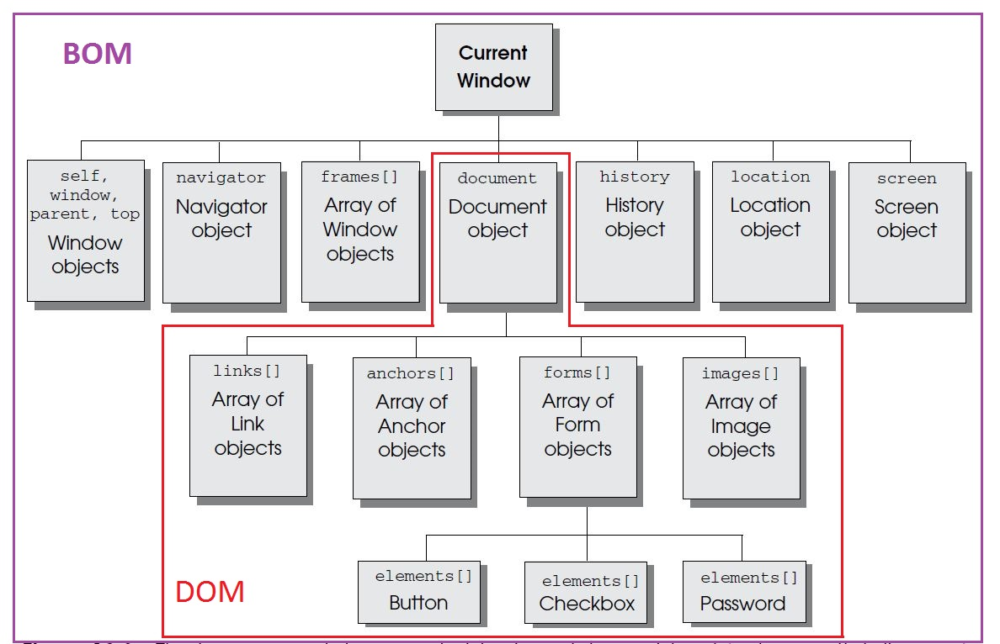

# About learning JavaScript

# Book
#### [You Don't Know JS series](https://github.com/getify/You-Dont-Know-JS)
- [You Don't Know JS: Scope & Closures](https://github.com/getify/You-Dont-Know-JS/blob/master/scope%20&%20closures/README.md#you-dont-know-js-scope--closures)
  
- [You Don't Know JS: this & Object Prototypes](https://github.com/getify/You-Dont-Know-JS/blob/master/this%20&%20object%20prototypes/README.md#you-dont-know-js-this--object-prototypes)
  
- [You Don't Know JS: Types & Grammar](https://github.com/getify/You-Dont-Know-JS/blob/master/types%20&%20grammar/README.md#you-dont-know-js-types--grammar)
  
- [You Don't Know JS: Async & Performance](https://github.com/getify/You-Dont-Know-JS/blob/master/async%20&%20performance/README.md#you-dont-know-js-async--performance)
  
- [You Don't Know JS: ES6 & Beyond](https://github.com/getify/You-Dont-Know-JS/blob/master/es6%20&%20beyond/README.md#you-dont-know-js-es6--beyond)

#### JavaScript. The Definitive Guide, David Flanagan

# Video
- [Douglas Crockford: The JavaScript Programming Language](https://www.youtube.com/watch?v=v2ifWcnQs6M)
- [Douglas Crockford: Advanced JavaScript](https://www.youtube.com/watch?v=DwYPG6vreJg)
- [Douglas Crockford: An Inconvenient API - The Theory of the DOM](https://www.youtube.com/watch?v=Y2Y0U-2qJMs)
- and more...

# Tools
- [JSLint](http://www.jslint.com/)
- [Can I Use](http://caniuse.com)
- [cordova](https://cordova.apache.org/)   hybrid apps
- Google map api
- [Sencha Ext JS](https://www.sencha.com/products/extjs/#overview)

# Articles
- [3 JavaScript questions to watch out for during coding interviews](https://medium.freecodecamp.com/3-questions-to-watch-out-for-in-a-javascript-interview-725012834ccb#.mfc6xdg3d)

  - Question #1: Event delegation
  - Question #2: Using a closure within a loop
  - Question #3: Debouncing
  
- [JavaScript’s Apply, Call, and Bind Methods are Essential for JavaScript Professionals](http://javascriptissexy.com/javascript-apply-call-and-bind-methods-are-essential-for-javascript-professionals/)
    
# Basic Knowledge
### Variable scope and hoisting
- [Demystifying JavaScript Variable Scope and Hoisting](https://www.sitepoint.com/demystifying-javascript-variable-scope-hoisting/)
- scope problem of setInterval() / setTimeout()
  - [Referencing “this” inside setInterval/setTimeout within object prototype methods
](http://stackoverflow.com/questions/7890685/referencing-this-inside-setinterval-settimeout-within-object-prototype-methods)

## Functions
- function declaration vs. function expression
  they are two ways of defining equivalent functions.
  ```javascript
  // function declaration
  function capitalize(str) {
    return str.charAt(0).toUpperCase() + str.slice(1);
  }
  
  // function expression
  var capitalize = function(str) {
    return str.charAt(0).toUpperCase() + str.slice(1);
  }
  ```

- Understanding _arguments_ Object

- Understanding _this_ object

- Function Binding (call / apply / bind)
  - [call()](https://developer.mozilla.org/en-US/docs/Web/JavaScript/Reference/Global_Objects/Function/call)
  
    func.call(thisObj[, arg1[, arg2[, ...]]])
    
    return the result of calling the function with the specified _this_ value and arguments.
    
    
  - [apply()](https://developer.mozilla.org/en-US/docs/Web/JavaScript/Reference/Global_Objects/Function/apply)
  
    The apply() method calls a function with a given this value and arguments provided as an array (or an array-like object).
  
    func.apply(thisObj[, arg_arr])
    
    **the arguments are passed to the function are specified as an array** : arg_arr = [arg1[, arg2[, ...]]].
    
    return the result of calling the function with the specified _this_ value and arguments.
    
  - [bind()](https://developer.mozilla.org/en-US/docs/Web/JavaScript/Reference/Global_Objects/Function/bind)
  
    func.bind(thisObj[, arg1[, arg2[, ...]]])
    
    return a copy of the given function with the specified _this_ value and initial arguments.
    
    The bind() function creates a **new bound function (BF)**. It creates a new function instance whose _this_ value is bound to the value that was passed into bind().
  
  - compare
  
    Use **.bind()** when you want that function to **later be called** with a certain context, useful in events. Use **.call() or .apply()** when you want to invoke the funciton **immediately**, and modify the context.

    Call/apply call the function immediately, whereas bind returns a function that when later executed will have the correct context set for calling the original function. This way you can maintain context in async callbacks, and events.
  
    for [example](http://stackoverflow.com/questions/15455009/javascript-call-apply-vs-bind)
    ```javascript
    function MyObject(element) {
      this.elm = element;

      element.addEventListener('click', this.onClick.bind(this), false);
    };

    MyObject.prototype.onClick = function(e) {
         var t=this;  //do something with [t]...
        //without bind the context of this function wouldn't be a MyObject
        //instance as you would normally expect.
    };
    ```

- Closure

  a closure is simply an outer function that returns an inner function. Doing this creates a mechanism to return an enclosed scope on demand.
  
  Closures have access to the outer function’s variable even after the outer function returns.
  
  Closures store references to the outer function’s variables; they do not store the actual value.

- use function to implement module
  ```javascript
      function moduleA() {
          var secretValue = 21;
          return {
              getSecretValue : function () {
                  return secretValue;
              },
              setSecretValue : function (val) {
                  secretValue = val;
              }
          }
      }

      var someObj = moduleA();
      console.log(someObj.getSecretValue());
      someObj.setSecretValue(43);
      console.log(someObj.getSecretValue());
  ```
  
- What are the advantages of IIFEs(Immediately Invoked Functon Expressions)?
  - [Immediately-Invoked Function Expression (IIFE)](http://benalman.com/news/2010/11/immediately-invoked-function-expression/)
  - [Quora Answer](https://www.quora.com/What-are-the-advantages-of-using-an-immediately-invoked-function-expression)
    - Module pattern can  be implemented with the help of IIFE.
    - One of the most common ways in which immediate functions are used: as simple, self-contained wrappers for functionality. The variables needed for the unit of functionality are trapped in the closure, but they aren’t visible anywhere else.
    - Enforcing the use of a name within an enclosed scope. 
    - Keeping code readable with shorter names.
    - Using an immediate function to handle the iterator properly.

- [Demystifying JavaScript Closures, Callbacks and IIFEs](https://www.sitepoint.com/demystifying-javascript-closures-callbacks-iifes/)
  - In Javascript, a **closure** is any function that keeps **_reference_** to variables from its _parent’s scope even after the parent has returned_. Closures keep references to outer variables, and thus, they _return the most recent/updated values_.
  
    So, what do you think is going to be the output of the following example?
    ```javascript
    function printFruits(fruits){
      for (var i = 0; i &lt; fruits.length; i++) {
        setTimeout( function(){
          console.log( fruits[i] );
        }, i * 1000 );
      }
    }

    printFruits(["Lemon", "Orange", "Mango", "Banana"]);
    ```
    
    the output is four times “undefined”.
    
    How to fix it? (See IIFE).
  
  - In JavaScript, functions are first-class objects. One of the consequences of this fact is that functions can be passed as arguments to other functions and can also be returned by other functions.
  
    A function that takes other functions as arguments or returns functions as its result is called a _higher-order function_, and the function that is passed as an argument is called a **callback function**. It’s named “callback” because at some point in time it is “called back” by the higher-order function.
    
    Callbacks are heavily used in JavaScript libraries to provide generalization and reusability. They allow the library methods to be easily customized and/or extended. Also, the code is easier to maintain, and much more concise and readable. Every time you need to transform your unnecessary repeated code pattern into more abstract/generic function, callbacks come to the rescue.
    
    Put the repeated code pattern into _higher-order function_,  and leave only the specific data inside _callback functions_.
    
    Example:    
    - setTimeout() and setInterval()
    ```javascript
    function showMessage(message){
      setTimeout(function(){
        alert(message);
      }, 3000);  
    }

    showMessage('Function called 3 seconds ago');
    ```
    - Another example is when we attach an event listener to an element on a page.
    ```html
    <button id='btn'>Click me</button>
    ```
    ```javascript
    function showMessage(){
      alert('Woohoo!');
    }

    var el = document.getElementById("btn");
    el.addEventListener("click", showMessage);
    ```
    
    The callback can be an existing function as shown in the preceding example, or it can be an anonymous function, which we create when we call the higher-order function.
    ```javascript
    function fullName(firstName, lastName, callback){
      console.log("My name is " + firstName + " " + lastName);
      callback(lastName);
    }

    fullName("Jackie", "Chan", function(ln){console.log('Welcome Mr. ' + ln);});
    ```
    
  - An Immediately-invoked function expression, or **IIFE** (pronounced “iffy”), is a function expression (named or anonymous) that is executed right away after its creation.
  
    An IIFE is often used to create scope to encapsulate modules. Within the module there is a private scope that is self-contained and safe from unwanted or accidental modification. This technique, called the module pattern, is a powerful example of using closures to manage scope, and it’s heavily used in many of the modern JavaScript libraries (jQuery and Underscore, for example).
  
    There are two slightly different syntax variations of this pattern:
    ```javascript
    // variant 1

    (function () {
      alert('Woohoo!');
    })();

    // variant 2

    (function () {
      alert('Woohoo!');
    }());
    ```
    
    The problem of closure can be fixed by closing the setTimeout() method in an IIFE, and defining a private variable to hold the current copy of i.    
    ```javascript
    function printFruits(fruits){
      for (var i = 0; i < fruits.length; i++) {
        (function(){
          var current = i;                    // define new variable that will hold the current value of "i"
          setTimeout( function(){
            console.log( fruits[current] );   // this time the value of "current" will be different for each iteration
          }, current * 1000 );
        })();
      }
    }

    printFruits(["Lemon", "Orange", "Mango", "Banana"]);
    ```
    Or
    ```javascript
    function printFruits(fruits){
      for (var i = 0; i < fruits.length; i++) {
        (function(current){
          setTimeout( function(){
            console.log( fruits[current] );
          }, current * 1000 );
        })( i );
      }
    }

    printFruits(["Lemon", "Orange", "Mango", "Banana"]);
    ```

- Factory Functions vs Constructor Functions vs Classes
  - [JavaScript Factory Functions vs Constructor Functions vs Classes](https://medium.com/javascript-scene/javascript-factory-functions-vs-constructor-functions-vs-classes-2f22ceddf33e#.893p2krj8)
   
- Event Loop
  - [MDN Concurrency model and Event Loop](https://developer.mozilla.org/en-US/docs/Web/JavaScript/EventLoop)
  - [Philip Roberts: What the heck is the event loop anyway?](https://www.youtube.com/watch?v=8aGhZQkoFbQ)  

## Objects
### User Defined Objects
- [JavaScript Objects in Detail](http://javascriptissexy.com/javascript-objects-in-detail/)

- [object literal notation vs constructor](http://stackoverflow.com/questions/4859800/should-i-be-using-object-literals-or-constructor-functions)
  - If you **don't have behaviour** associated with an object (i.e. if the object is just a container for data/state), use an object literal. Furthermore, Object literals are basically singletons with variables/methods that are all public.
  ```javascript
  var data = {
      foo: 42,
      bar: 43
  };
  data.foo = 12;
  data.bar = 99;
  ```
  - Object defined with a constructor lets you have multiple instances of that object. If you want to use **(semi-)private variables or functions** in you object, a constructor function is the way to do it.
  ```javascript
  function MyData(foo, bar) {
      var _foo = foo;   // private
      this.bar = bar;   // public

      this.verify = function () {
          return _foo === this.bar;   // _foo doesn't need this
      };
  }
  ```
  - Prototype lets you attach each function once and only once: they'll be inherited by the instances through prototypal inheritance.
  ```javascript
  MyData.prototype.verify = function () {
      return this.foo === this.bar;
  };
  ```
  
- Basic class, subclass and inheritance
  - MDN [Details of the object model](https://developer.mozilla.org/en-US/docs/Web/JavaScript/Guide/Details_of_the_Object_Model)
    **Prototypal Inheritance**
  
- Quora [Object vs Class vs Function](http://stackoverflow.com/questions/17525450/object-vs-class-vs-function)
  - prototypal pattern vs. constructor pattern

- Quora [Benefits of prototypal inheritance over classical?](http://stackoverflow.com/questions/2800964/benefits-of-prototypal-inheritance-over-classical)
  - Quora [Understanding the difference between Object.create() and new SomeFunction()](http://stackoverflow.com/questions/4166616/understanding-the-difference-between-object-create-and-new-somefunction)
  - [Why Prototypal Inheritance Matters](http://aaditmshah.github.io/why-prototypal-inheritance-matters/#constructors_vs_prototypes)

### Core Objects
#### Array Object
- Array methods

Method | What It Does
------ | ----------------------------------------------------------------
concat() | Concatenates elements from one array to another array.
join() | Joins the elements of an array by a separator to form a string.
pop() | Removes and returns the last element of an array.
push() | Adds elements to the end of an array.
reverse() | Reverses the order of the elements in an array.
shift() | Removes and returns the first element of an array.
slice() | Creates a new array from elements of an existing array.
sort() | Sorts an array alphabetically or numerically.
splice() | Removes and/or replaces elements of an array.
toLocaleString() | Returns a string representation of the array in local format.
toString() | Returns a string representation of the array.
unshift() | Adds elements to the beginning of an array.

#### Date Object
- methods
  - [methods list] (https://www.tutorialspoint.com/javascript/javascript_date_object.htm)
  - [methods detail](https://developer.mozilla.org/en-US/docs/Web/JavaScript/Reference/Global_Objects/Date)

#### Math Object
- properties

Property | Value | Description
-------- | ----- | -----------------------------------------------------------------------
Math.E | 2.718281828459045091 | Euler’s constant, the base of natural logarithms
Math.LN2 | 0.6931471805599452862 | Natural log of 2
Math.LN10 | 2.302585092994045901 | Natural log of 10
Math.LOG2E | 1.442695040888963387 | Log base-2 of E
Math.Log10E | 0.4342944819032518167 | Log base-10 of E
Math.PI | 3.14592653589793116 | Pi, ratio of the circumference of a circle to its diameter
Math.SQRT1_2 | 0.7071067811865475727 | 1 divided by the square root of 2
Math.SQRT2 | 1.414213562373985145 | Square root of 2


- methods (mostly used)

Method | Functionality
------ | ------------------------------------------------------------------
Math.abs(Number) | Returns the absolute (unsigned) value of Number
Math.ceil(Number) | Rounds Number up to the next closest integer
Math.floor(Number) Rounds | Number down to the next closest integer
Math.max(Number1, Number2) | Returns larger value of Number1 and Number2
Math.min(Number1, Number2) | Returns smaller value of Number1 and Number2
Math.random() | Generates pseudorandom number between 0.0 and 1.0
Math.round(Number) | Rounds Number to the closest integer
Math.toString(Number) | Converts Number to string

### Wrapper Objects
#### String Object
- properties

Property | What It Does
-------- | ------------------------------------------------------------------------
length | Returns the length of the string in characters.
constructor | Returns the function that created the String object.
prototype | Extends the definition of the string by adding properties and methods.

- HTML methods

Method | Formats as HTML
------ | -----------------------------------------
String.anchor(Name) | ```<a name="Name">String</a>```
String.big() | ```<big>String</big>```
String.blink() | ```<blink>String</blink>```
String.bold() | ```<b>String</b>```
String.fixed() | ```<tt>String</tt>```
String.fontcolor(color) | ```<font color="color">String</font> e.g., <font color="blue">String</font>```
String.fontsize(size) | ```<font size="size">String</font> e.g., <font size="+2">String</font>```
String.italics() | ```<i>String</i>```
String.link(URL) | ```<a href="URL">String</a> e.g., <a href="http://www.ellieq.com">String</a>```
String.small() | ```<small>String</small>```
String.strike() | ```<strike>String</strike> (puts a line through the text)```
String.sub() | ```<sub>String</sub> (creates a subscript)```
String.sup() | ```<sup>String</sup> (creates a superscript)```

- methods for manipulation

Method | What It Does
------ | -------------------------------------------------------------------------------
charAt(index) | Returns the character at a specified index position.
charCodeAt(index) | Returns the Unicode encoding of the character at a specified index position.
**concat(string1, ..., stringn)** | Concatenates string arguments to the string on which the method was invoked.
fromCharCode(codes) | Creates a string from a comma-separated sequence of character codes.
**indexOf(substr, startpos)** | Searches for the **first occurrence** of substr starting at startpos and returns the startpos(index value) of substr.
**lastIndexOf(substr, startpos)** | Searches for the **last occurrence** of substr starting at startpos and returns the startpos (index value) of substr.
replace(searchValue, replaceValue) | Replaces searchValue with replaceValue.
search(regexp) | Searches for the regular expression and returns the index of where it was found.
**slice(startpos[, endpos])** | Returns string containing the part of the string from startpos to endpos.
**split(delimiter)** | Splits a string into an array of words based on delimiter.
**substr(startIdx[,length])** | returns the characters in a string beginning at the startIdx through the specified number of characters.
**substring(startpos, endpos)** | Returns a subset of string starting at startpos up to, but not including, endpos.
toLocaleLowerCase() | Returns a **copy** of the string converted to lowercase.
toLocaleUpperCase() | Returns a **copy** of the string converted to uppercase.
**toLowerCase()** | Converts all characters in a string to lowercase letters.
toString() | Returns the same string as the source string.
**toUpperCase()** | Converts all characters in a string to uppercase letters.
valueOf | Returns the string value of the object.

  - [JavaScript : String.slice() vs String.substring() vs String.substr() - See more at: http://www.tothenew.com/blog/javascript-slice-vs-substring-vs-substr/#sthash.wsuUQmk4.dpuf](http://www.tothenew.com/blog/javascript-slice-vs-substring-vs-substr/)
    - MDN [substr()](https://developer.mozilla.org/en-US/docs/Web/JavaScript/Reference/Global_Objects/String/substr)
    - MDN [substring()](https://developer.mozilla.org/en-US/docs/Web/JavaScript/Reference/Global_Objects/String/substring)
    - MDN [slice()](https://developer.mozilla.org/en-US/docs/Web/JavaScript/Reference/Global_Objects/String/slice)
    - **[Summary of comparation with example]**(https://docs.google.com/spreadsheets/d/1nBhkxBIs7KWecbTa69zBkRd8Q8yptvz9dWLux4LMeNE/edit#gid=0)

#### Number Object
- properties

Property | What It Describes
-------- | --------------------------------------------------------------
MAX_VALUE | The largest representable number, 1.7976931348623157e+308
MIN_VALUE | The smallest representable number, 5e–324
NaN | Not-a-number value
NEGATIVE_INFINITY | Negative infinite value; returned on overflow
POSITIVE_INFINITY | Infinite value; returned on overflow
prototype | Used to customize the Number object by adding new properties and methods

- methods

Method | What It Does
------ | ---------------------------
toString() | Converts a number to a string using a specified base (radix)
toLocaleString() | Converts a number to a string using local number conventions
toFixed() | Converts a number to a string with a specified number of places after the decimal point
toExponential() | Converts a number to a string using exponential notation and a specified number of places after the decimal point
toPrecision() | Converts a number to a string in either exponential or fixed notation containing the specified number of places after the decimal point

#### Boolean Object
The Boolean object was included in JavaScript 1.1. It is used to convert a non-Boolean value to a Boolean value, either true or false. There is **one property**, the **prototype property**, and **one method**, the **toString() method**, which converts a Boolean value to a string; thus, true is converted to “true” and false is converted to “false”.

#### Function Object
- properties

Property | What It Does
-------- | --------------
length | Returns the number of arguments that are expected to be passed (read only).
prototype | Allows the object to be customized by adding new properties and methods.

- methods

Property | What It Does
-------- | --------------------
apply() | Allows you to apply a method from one function to another.
call() | Allows you to call a method from another object.

## BOM
### Hierarchy of the browser object model and document object model.



In the browser object model, sometimes called BOM, the window is at the top of the tree, and below it are objects: _**window, navigator, frames[], document, history, location**_, and _**screen**_.

#### navigator object
- The navigator object can be used for platform-specific checking to determine the version of the browser being used, whether Java is enabled, what plug-ins are available, and so on.

- properties of navigator object

Property | What It Describes
-------- | ----------------------------
appCodeName | Code name for the browser.
appName | Name of the browser.
appVersion | Version of the browser.
mimeTypes | An array of MIME types supported by the browser.
platform | The operating system where the browser resides.
userAgent | HTTP user-agent header sent from the browser to the server.
plugins[] | plugin object array, include all plugins installed for the browser.
mimeTypes[] | list of MIME types.

- geolocation object (https://developer.mozilla.org/en-US/docs/Web/API/Geolocation/Using_geolocation)
  - getCurrentPosition()
  - watchPosition()
  - clearWatch() : stop watching the user's location.

- others
  - plug-ins
  
  Plug-ins are special software programs that can be downloaded to add the ability to listen to audio, watch videos and movie clips, display animation, and create special image viewing files. Some examples of plug-ins are Macromedia Shockwave or Flash player, Adobe Acrobat Reader, and RealNetworks RealPlayer. Plugins can be platform dependent and their MIME types can vary as well.
  
  - ActiveX
  
  ActiveX controls are used as a means to embed objects or components into a Web page. Online spreadsheets, security updates, word processors, patches, and timers are examples of such components. You can add ActiveX controls to your Web pages by using the standard HTML <object> tag. The <object> tag takes a set of parameters that specify which data the control should use and defines its appearance and behavior.
  
  - MIME : Multipurpose Internet mail extensions. 
  
  It is a standard format for sending mail messages across the Internet. Now it is used to exchange all kinds of file types across the Internet, such as audio, video, and image files. All browsers have a list of MIME types.
  
#### window object
The window object is where all the action happens in a browser. It’s at the top of the Java-Script hierarchy, and is automatically defined for each window that you open. 

The window object comes with a number of properties and methods. Because it is the basis of all objects, the name of the window object can be excluded when applying methods to it.

- properties
- methods

Method | What It Does
------ | ------------------
open(url, name, [options]) | Opens a new window and returns a new window object. **options**
close() | Closes a window.
alert(text) | Creates a triangular dialog box with a message in it.
prompt(text, defaultInput) | Creates a dialog prompt box to ask for user input.
confirm() | Creates a dialog box for user confirmation.
setInterval(expression, milliseconds) | After a specified interval, evaluates an expression.
setInterval(function, milliseconds, [arguments]) | After a specified interval, evaluates a function.
setTimeout(expression, milliseconds) | After a timeout period has elapsed, evaluates an expression.
setTimeout(function, milliseconds, [arguments]) | After a timeout period has elapsed, evaluates a function.
clearInterval(interval) | Clears a previously set interval timer.
clearTimeOut(timer) | Clears a previously set timeout.   
blur() | Removes focus from the window.
focus() | Gives the focus to a window.
scroll(x, y) | Scrolls to a pixel position in a window.
moveBy() | e.g, moveBy(20,20), Moves the window relatively by 20 pixels.
moveTo() | e.g, moveTo(0,0), Moves to the top, left corner of the screen.
resizeBy() | e.g, resizeBy(15,10), Resizes the window relatively by 15 × 10 pixels.
resizeTo() | e.g, resizeTo(450,350), Resizes the window absolutely to 450 × 350 pixels.

#### frame object
Frames allow you to display more than one Web page in the same window.

When a page is divided into frames, the visitor cannot bookmark the page if the browser is not pointing to the top frameset. The _location object_ can be used to make sure the topmost window is the one currently viewed in the browser.

- Use ```<frameset>``` instead of ```<body>``` tag to build frames in a web page. 
- Use cols and rows attribute to specify how much room the frame will need within the window.
- Example
```html
<html>
<head><title>Frame Me!</title></head>
<!-- Creating the framesets for two files -->
<!-- This file is named: framesets.html -->
  <frameset cols="25%,75%">
  <frame src="leftframe.html" >
  <frame src="rightframe.html" >
  </frameset>
</html>
----------------------------------------------------------------------
<html>
<head><title>Left Frame</title></head>
<!--This file is named: leftframe.html -->
  <body bgColor="yellow">
<h2>
  Just to show you that this is the left frame
</h2>
</body>
</html>
----------------------------------------------------------------------
<html>
<head><title>Right Frame</title></head>
  <!--This file is named: rightframe.html -->
  <body bgColor="lightgreen">
<h2>
Just to show you that this is the right frame
</h2>
</body>
</html>
```

#### location object
The location object is a property of the window object and is used to access the URL of the document currently loaded in the window.
- properties

Property | What It Describes in the URL
-------- | ------------------------------
hash | If it exists, the anchor part.
host | The hostname:port.
hostname | The hostname.
_**href**_ | The entire URL. href puts the new page at the top of the history list.
pathname | The pathname.
port | The port number.
protocol | The protocol and colon.
search | The query string.

- methods

Method | What It Does
------ | -------------
**assign()** | Load and display the document at the URL specified.
**replace()** | Replaces the current page with a new one. cannot go back to the prev page. It removes the current page from the history list and replaces it with the new page.
reload() | Reloads the current URL.
unwatch() | Removes a watch point on the location property.
watch() | Sets a watch point on the location property; that is, calls a function if the property changes.

#### history object
The history object is a property of the window object. It keeps track of the pages (in a stack) that the user has visited. The history object is most commonly used in JavaScript to move back or forward on a page, similar to the back button and forward button supported
by your browser. The history object can reference only those pages that have been visited; that is, those pages on its stack.

- properties

Property | What It Describes in the URL
-------- | -------------------------------
length | The number of entries in the history object.
current | The current document URL.
next | The URL of the next document in the history object.
previous | The URL of the previous document in the history object.
search | The query string.

- methods

Method | What It Does
------ | ----------------
back() | Goes to the previous URL entry in the history list; like the browser’s back button.
forward() | Goes to the next URL entry in the history list; like the browser’s forward button.
go() | The browser will go forward or back (if the value is negative) the number of specified pages in the history object.

#### screen object
The screen object is a property of the window object and is automatically created when a user loads a Web page. It gives you access to the various properties of the user’s screen such as its height, width, color depth, and so on. This can be helpful when designing pages that will require specific dimensions. There are no event handlers for this object.

- properties

Property | What It Describes
-------- | -----------------
height | The pixel height of the screen.
width | The pixel width of the screen.
availHeight | The pixel height of the screen, minus toolbars, and so on.
availWidth | The pixel width of the screen, minus toolbars, and so on.
availLeft | The x coordinate of the first pixel, minus toolbars, and so on.
availTop | The y coordinate of the first pixel, minus toolbars, and so on.
colorDepth | The maximum amount of colors that the screen can display.
pixelDepth | The number of bits per pixel of the screen.


# Recommended Reference
- http://javascriptissexy.com/how-to-learn-javascript-properly/
- http://eloquentjavascript.net/
- https://developer.mozilla.org/en-US/docs/Web/JavaScript/Guide/Introduction

- [Code Conventions for the JavaScript Programming Language](http://javascript.crockford.com/code.html)
