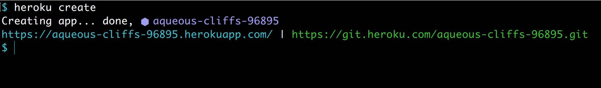
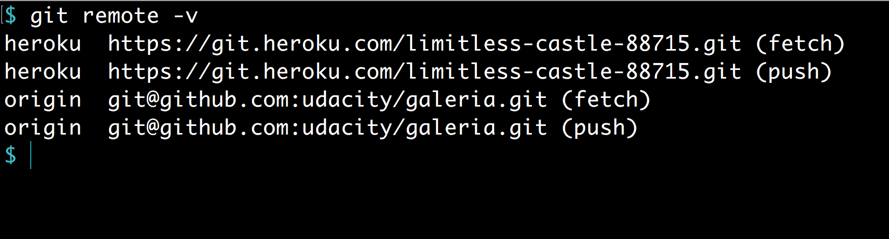

# WebDev
all web development exercises

# Learning Materials
## HTML / HTML5
### HTML5
- W3Cx : [HTML5 and CSS Fundamentals](https://courses.edx.org/courses/course-v1:W3Cx+HTML5.0x+1T2017/course/)
- W3Cx : [HTML5 Coding Essentials and Best Practices](https://courses.edx.org/courses/course-v1:W3Cx+HTML5.1x+1T2017/course/)
- W3Cx : [HTML5 Apps and Games](https://courses.edx.org/courses/course-v1:W3Cx+HTML5.2x+3T2017/course/)

# Online tools
- [W3C developer tools](http://w3c.github.io/developers/tools/)
- [W3C cheatsheet](http://www.w3.org/2009/cheatsheet/)

# TBD
- [Create a Web App and RESTful API Server Using the MEAN Stack](https://devcenter.heroku.com/articles/mean-apps-restful-api)
## HEROKU
- [Deploying a MEAN stack app to Heroku](http://www.tilcode.com/deploying-a-mean-stack-app-to-heroku/)
- [MEAN Stack App Part 20: Deploy App Using Heroku](https://www.youtube.com/watch?v=IhU6x94eTXU)
- [MongoDB for your Heroku NodeJS app](https://www.youtube.com/watch?v=GDqtv1eGGpA&t=13s)
- [Getting Started on Heroku with Node.js](https://devcenter.heroku.com/articles/getting-started-with-nodejs#deploy-the-app)
- [Heroku Cannot GET /](https://stackoverflow.com/questions/24566635/heroku-cannot-get)
- [How to Add a Favicon to your Site](https://www.w3.org/2005/10/howto-favicon)
- [Setting up favicon.ico](http://befused.com/html/setting-favicon-ico)
- [How To Create And Install A favicon.ico](http://www.winterdrache.de/freeware/png2ico/favicon.html)

### Deploying app to Heroku
#### [Heroku setup](https://classroom.udacity.com/courses/ud272/lessons/b36fbb24-bfb1-4401-bb8d-9fff509bf016/concepts/89efbf29-454f-4b3d-9af7-006aff792b41)
- register a Heroku account;
- download [Heroku Toolbelt](https://devcenter.heroku.com/articles/heroku-cli), i.e. Heroku CLI;
- Heroku Login

  Under command line shell, input `heroku login`. This will prompt you for your Heroku email and password. You won’t have to log in every time you want to deploy, your credentials will be saved for some time.

  

- install Git
- change your working directory to the repository directory
- Heroku Create

  To get yourself deployed on Heroku, you must first create a remote on Git. To do this you have to run the `heroku create` command. This will make a new remote repo named heroku where the code will be pushed to.
  
  
  
  If you want to create a new app named “example”, run `heroku create exmaple`.
  
  To ensure you have properly created this remote, run the `git remote -v` command, you should see something output that reveals the two remotes listed, origin and heroku.
  
  
  
- Git Push Heroku Master

  `git push heroku master` : pushing repo to the heroku remote.
  
  From this point you will see a large output from Heroku that is listing all of the libraries and tools that are being installed on the Heroku machine before your code is finally decompressed and launched onto the online server.
  
  
  
  Once you have your application deployed, Heroku will provide you with a URL you can visit to see your site.
  
- Heroku Open

  `heroku open` : This will open up a browser window and navigate to the deployed application URL.
  
  
