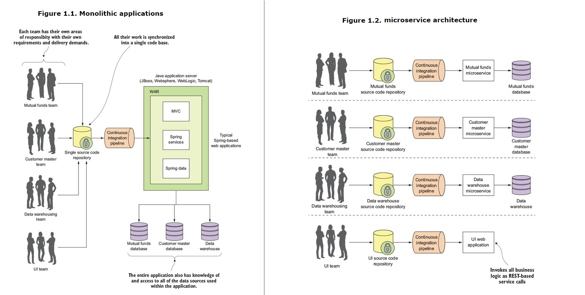

## Book : Spring Microservices in Action
### Main Content
- What a microservice is and the design considerations that go into building a microservice-based application
- When you shouldn’t build a microservice-based application
- How to build microservices using the Spring Boot framework
- The core operational patterns that need to be in place to support microservice applications, particularly a cloud-based application
- How you can use Spring Cloud to implement these operational patterns
- How to take what you’ve learned and build a deployment pipeline that can be used to deploy your services to a private, internally managed cloud or a public cloud provider

### 1. [Chapter 1](http://proquest.safaribooksonline.com.rpa.sccl.org/book/web-development/9781617293986/chapter-1dot-welcome-to-the-cloud-spring/kindle_split_010_html) : Welcome to the cloud, Spring
#### 1.1 Understanding microservices and why companies use them
##### 1.1.1 Monolithic architecture vs. Microservices architecture
- In a monolithic architecture, an application is delivered as a single deployable software artifact. All the UI (user interface), business, and database access logic are packaged together into a single application artifact and deployed to an application server.
- A microservice is a small, loosely coupled, distributed service. The key concept you need to embrace as you think about microservices is decomposing and unbundling the functionality of your applications so they’re completely independent of one another.

A microservice architecture has the following characteristics:

- Application logic is broken down into small-grained components with well-defined boundaries of responsibility that coordinate to deliver a solution.
- Each component has a small domain of responsibility and is deployed completely independently of one another. Microservices should have - responsibility for a single part of a business domain. Also, a microservice should be reusable across multiple applications.
- Microservices communicate based on a few basic principles (notice I said principles, not standards) and employ lightweight communication protocols such as HTTP and JSON (JavaScript Object Notation) for exchanging data between the service consumer and service provider.
- The underlying technical implementation of the service is irrelevant because the applications always communicate with a technology-neutral protocol (JSON is the most common). This means an application built using a microservice application could be built with multiple languages and technologies.
- Microservices—by their small, independent, and distributed nature—allow organizations to have small development teams with well-defined areas of responsibility. These teams might work toward a single goal such as delivering an application, but each team is responsible only for the services on which they’re working.

##### 1.1.2 Why change the way we build applications?
The following forces are impacting the way developers have to think about building applications:
- Complexity has gone way up : Today’s applications need to talk to multiple services and databases residing not only inside a company’s data center, but also to external service providers over the internet.
- Customers want faster delivery
- Performance and scalability : Global applications make it extremely difficult to predict how much transaction volume is going to be handled by an application and when that transaction volume is going to hit. Applications need to scale up across multiple servers quickly and then scale back down when the volume needs have passed.
- Customers expect their applications to be available

Keep in mind, **Small, Simple, and Decoupled Services = Scalable, Resilient, and Flexible Applications**.

#### 1.2 Using Spring, Spring Boot, and Spring Cloud for building microservices
##### 1.2.1 Spring, Spring Boot and Spring Cloud
- **Spring** has become the de facto development framework for building Java-based applications. At its core, Spring is based on the concept of _**dependency injection**_. In a normal Java application, the application is decomposed into classes where each class often has explicit linkages to other classes in the application. The linkages are the invocation of a class constructor directly in the code. Once the code is compiled, these linkage points can’t be changed.
- **Spring Boot** is a re-envisioning of the Spring framework. While it embraces core features of Spring, Spring Boot strips away many of the “enterprise” features found in Spring and instead delivers a framework geared toward _**Java-based, REST-oriented**_ (Representational State Transfer) microservices. With a few simple _**annotations**_, a Java developer can quickly build a REST microservice that can be packaged and deployed without the need for an external application container.
  - The core concept behind **REST** is that your services should embrace the use of the _**HTTP verbs (GET, POST, PUT, and DELETE)**_ to represent the core actions of the service and use a lightweight web-oriented data serialization protocol, such as JSON, for requesting and receiving data from the service.
- The **Spring Cloud** framework makes it simple to _**operationalize and deploy**_ microservices to a private or public cloud. Spring Cloud wraps several popular cloud-management microservice frameworks under a common framework and makes the use and deployment of these technologies as easy to use as annotating your code.

##### 1.2.2 Building a microservice with Spring Boot 
- A simple example : how to write a simple “Hello World” REST-service using Spring Boot.

#### 1.3 Learning why the cloud and microservices are relevant to microservice-based applications
#### 1.4 Building microservices involves more than building service code
#### 1.5 Understanding the parts of cloud-based development
#### 1.6 Using Spring Boot and Spring Cloud in microservice development

## [microservices](https://www.microservices.com/)
- [A typical microservices architecture](https://www.microservices.com/reference-architecture/)
