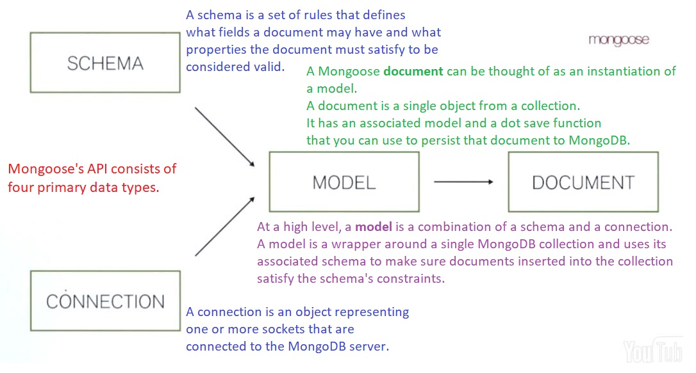
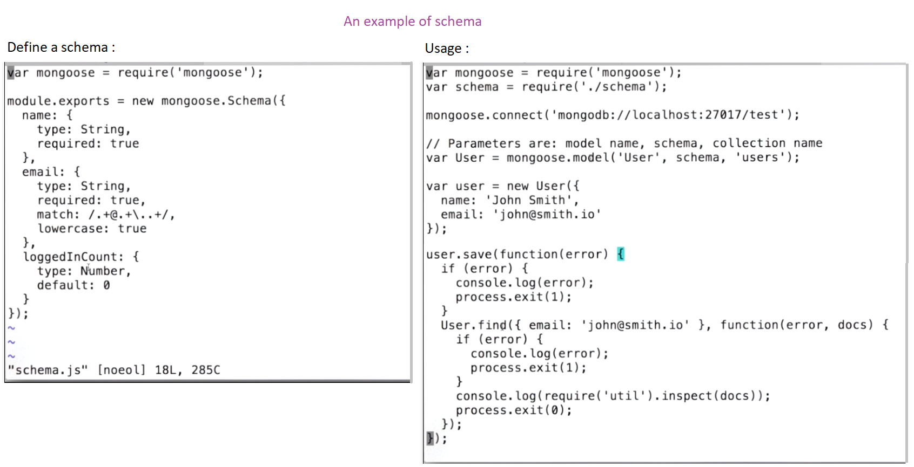

# [MongoDBx - M101x Introduction to MongoDB using the MEAN Stack](https://courses.edx.org/courses/course-v1:MongoDBx+M101x+2T2016/course/)
MongoDB basics

## Mongoose
### Mongoose API 4 primary data types


### Schema
#### [schema doc](http://mongoosejs.com/docs/guide.html)



### Mongoose population
- [Population](http://mongoosejs.com/docs/populate.html)

# Supplement Materials
- [O'Reilly Webcast: MongoDB Schema Design: How to Think Non-Relational](https://www.youtube.com/watch?v=PIWVFUtBV1Q)
- [6 Rules of Thumb for MongoDB Schema Design: Part 1](https://www.mongodb.com/blog/post/6-rules-of-thumb-for-mongodb-schema-design-part-1)
- [MongoDB - Data Modelling](https://www.tutorialspoint.com/mongodb/mongodb_data_modeling.htm)
- [MongoDB Schema Design: Four Real-World Examples](https://www.slideshare.net/friedo/data-modeling-examples)


# Extra
### [Mongoose limiting queries](https://stackoverflow.com/questions/29169834/mongoose-limiting-queries-doesnt-work)
- https://stackoverflow.com/questions/5830513/how-do-i-limit-the-number-of-returned-items
```
items.find().sort({field: 1}).limit(5).exec(function(err, theItems) {...})
```

### [Angular limiting item number per page](https://stackoverflow.com/questions/29469393/limiting-the-number-of-ngrepeat-to-10-but-it-shows-all-40-items-at-once)
```
ng-repeat="x in alpha | limitTo: 20"
```
