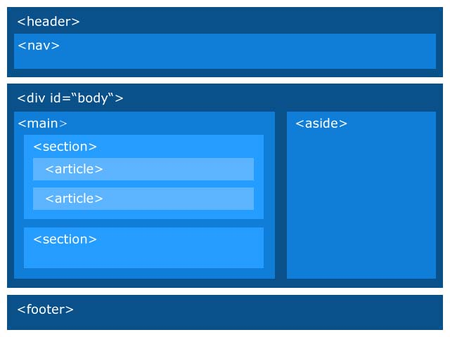
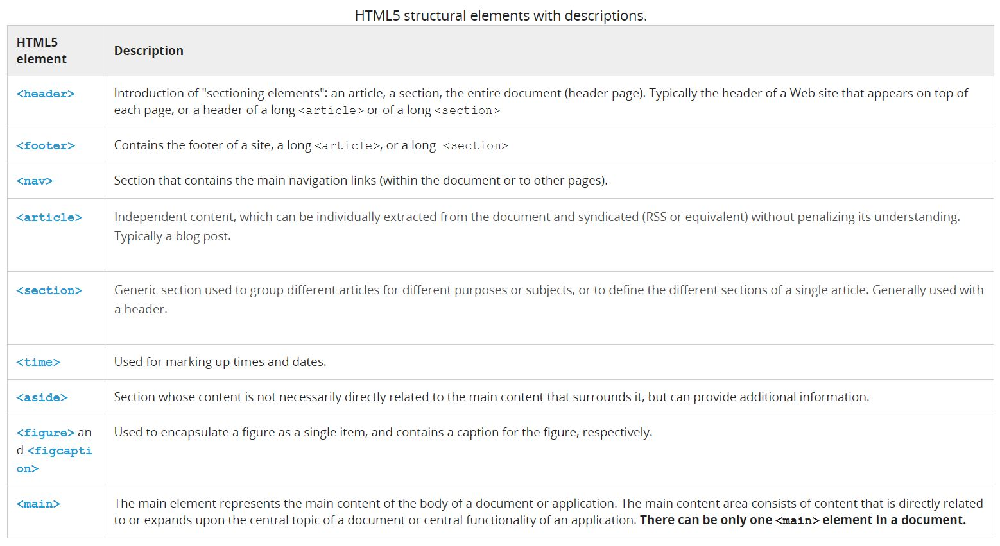

# Notes about html / css learning

### html

### CSS
- [The 30 CSS Selectors You Must Memorize](https://code.tutsplus.com/tutorials/the-30-css-selectors-you-must-memorize--net-16048)
- [CSS Transitions and Transforms for Beginners](https://robots.thoughtbot.com/transitions-and-transforms)
- [Align a pseudo element to the right and vertical center](https://stackoverflow.com/questions/30055459/align-a-pseudo-element-to-the-right-and-vertical-center)

### Reference
- [How to style checkbox using CSS?](http://stackoverflow.com/questions/4148499/how-to-style-checkbox-using-css)
- [10 Hilarious Lorem Ipsum Generators for Web Designers](http://theultralinx.com/2013/08/10-hilarious-lorem-ipsum-generators-web-designers/)
- [CSS Font Stack](http://www.cssfontstack.com/)
- [Google fonts](https://fonts.google.com/)
- hr style
  - [Simple Styles for ```<hr>```'s](https://css-tricks.com/examples/hrs/)
  - [18 Simple Styles for Horizontal Rules (hr CSS Design)](https://codepen.io/ibrahimjabbari/pen/ozinB)
- get images [unsplash](https://source.unsplash.com/)
- [How To Center Anything With CSS](https://codemyviews.com/blog/how-to-center-anything-with-css)


---
# HTML5
## New structural elements






### Best practices when using sectioning elements
- Best practice 1: always add a heading to explicit sectioning content (mainly for accessibility reasons )
  - Always use a heading element after a sectioning element, for example `<section><Hx>...</Hx>...</section>`, and after `<body>`, where x can be 1..6,
  - Or, use a `<header>` element, like in `<section><header><Hx>...</Hx>.....</header>...</section>`. **_You can use heading elements `<h1>...<h6>` in a `<header>` but be careful if you use more than one_**
  ```
  // Good:
  <section>
    <h1>Blog post of April 2015</h1>
    ...
  </section>
  
  // Good
  <section>
    <header>
       <h1>Blog post of April 2015</h1>
       <p>Posted by Michel Buffa...</p>
    </header>
    ...
  </section>
  
  // Bad:
  <section>
    <header>
      <p class="article title">Blog post of April 2015</p>
      <p>Posted by Michel Buffa...</p>
    </header>
    ...
  </section>
  ```
  
  Notice that <body> is also a sectioning element. It's called a "sectioning root", and would also need a heading.
  ```
  // Good
  <body>
    <h1>Example Blog</h1>
    <section>
      <header>
         <h2>Blog post of April 2015</h2>
         <p>Posted by Michel Buffa...</p>
      </header>
      <p>Content of the blog post...</p>
    </section>
  </body>
  ```
  
- Best practice 2: try not to rely on implicit sectioning, use `<section>, <article>`, etc. instead of just `<h1>...<h6>`

### `<main>`
- Constraints:
  - There must NOT be more than one `<main>` element in a document,
  - It must NOT be a descendent of an `<article>,<aside>, <footer>, <header>, or <nav>` element.
  
- Best practice:
  - For accessibility matters, a best practice is to split your page content into "regions" defined by the five 5 elements (aside, footer, header, main and nav).

### External resources:
- Structural elements
  - [the-importance-of-sections](http://coding.smashingmagazine.com/2013/01/18/the-importance-of-sections/)
  - [new-structural-elements-in-html5](https://dev.opera.com/articles/new-structural-elements-in-html5/)
  - [the-semantics-of-html5-structural-elements](http://colinaut.com/2009/10/15/the-semantics-of-html5-structural-elements/)
- main tag
  - http://www.w3.org/TR/html5/grouping-content.html#the-main-element
  - http://www.w3.org/html/wg/wiki/User:Sfaulkne/main-usecases#Introduction
  - https://developer.mozilla.org/en-US/docs/Web/HTML/Element/main
