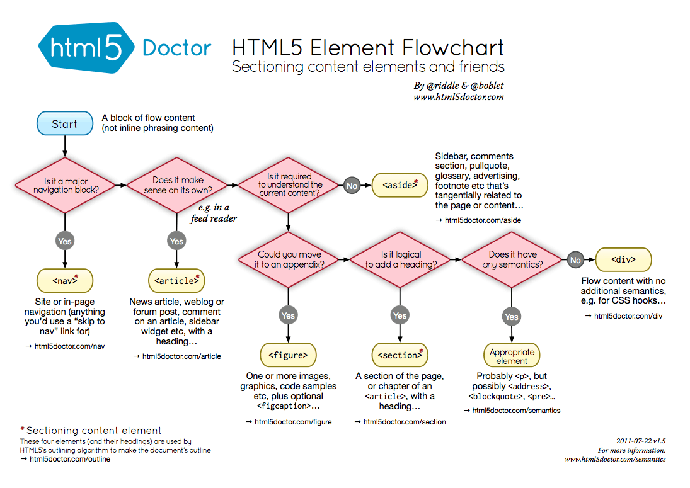

# Notes about html / css learning

### html

### CSS
- [The 30 CSS Selectors You Must Memorize](https://code.tutsplus.com/tutorials/the-30-css-selectors-you-must-memorize--net-16048)
- [CSS Transitions and Transforms for Beginners](https://robots.thoughtbot.com/transitions-and-transforms)
- [Align a pseudo element to the right and vertical center](https://stackoverflow.com/questions/30055459/align-a-pseudo-element-to-the-right-and-vertical-center)

### Reference
- [How to style checkbox using CSS?](http://stackoverflow.com/questions/4148499/how-to-style-checkbox-using-css)
- [10 Hilarious Lorem Ipsum Generators for Web Designers](http://theultralinx.com/2013/08/10-hilarious-lorem-ipsum-generators-web-designers/)
- [CSS Font Stack](http://www.cssfontstack.com/)
- [Google fonts](https://fonts.google.com/)
- hr style
  - [Simple Styles for ```<hr>```'s](https://css-tricks.com/examples/hrs/)
  - [18 Simple Styles for Horizontal Rules (hr CSS Design)](https://codepen.io/ibrahimjabbari/pen/ozinB)
- get images [unsplash](https://source.unsplash.com/)
- [How To Center Anything With CSS](https://codemyviews.com/blog/how-to-center-anything-with-css)


---
# HTML5
## New structural elements




#### External resources:
- [the-importance-of-sections](http://coding.smashingmagazine.com/2013/01/18/the-importance-of-sections/)
- [new-structural-elements-in-html5](https://dev.opera.com/articles/new-structural-elements-in-html5/)
- [the-semantics-of-html5-structural-elements](http://colinaut.com/2009/10/15/the-semantics-of-html5-structural-elements/)
