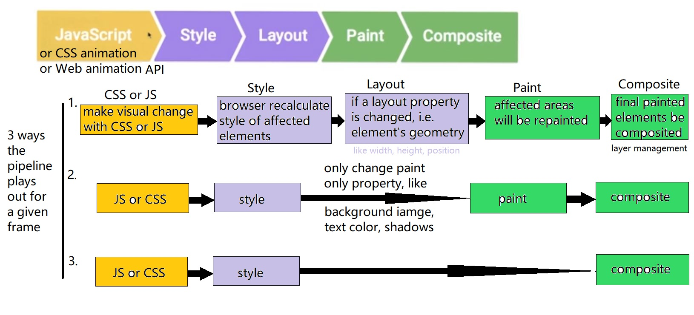

# Udacity
## 1. front-end beginner
### 1.1 [Intro to HTML and CSS](https://www.udacity.com/course/intro-to-html-and-css--ud304)
### 1.2 [Responsive Web Design Fundamentals](https://www.udacity.com/course/responsive-web-design-fundamentals--ud893)
### 1.3 [Responsive Images](https://www.udacity.com/course/responsive-images--ud882)
### 1.4 [JavaScript Basics](https://www.udacity.com/course/javascript-basics--ud804)
### 1.5 [Intro to jQuery](https://www.udacity.com/course/intro-to-jquery--ud245)
### 1.6 [Intro to AJAX](https://www.udacity.com/course/intro-to-ajax--ud110)
### 1.7 [Website Performance Optimization](https://www.udacity.com/course/website-performance-optimization--ud884)
- [Web Fundamentals : Critical Rendering Path](https://developers.google.com/web/fundamentals/performance/critical-rendering-path/) by Google
- Optimize the DOM
  - fewer bytes faster renders
    - [minify](https://developers.google.com/web/fundamentals/performance/optimizing-content-efficiency/optimize-encoding-and-transfer#minification-preprocessing--context-specific-optimizations)
    - [compress](https://developers.google.com/web/fundamentals/performance/optimizing-content-efficiency/optimize-encoding-and-transfer#text-compression-with-gzip)
    - [cache](https://developers.google.com/web/fundamentals/performance/optimizing-content-efficiency/http-caching)
- Unblocking CSS (CSS is render blocking, why wait on styles you don't need?)
  - split CSS file to multiple files and use @media to let browser know which ones are needed for current case.
    ```
    <link rel="stylesheet" href="style.css">
    <link rel="stylesheet" href="style-print.css" media="print">
    ```
  - [Render Blocking CSS](https://developers.google.com/web/fundamentals/performance/critical-rendering-path/render-blocking-css)
    - By default, CSS is treated as a render blocking resource.
    - Media types and media queries allow us to mark some CSS resources as non-render blocking.
    - The browser downloads all CSS resources, regardless of blocking or non-blocking behavior.
    ```
    <link href="style.css"    rel="stylesheet">
    <link href="style.css"    rel="stylesheet" media="all">
    <link href="portrait.css" rel="stylesheet" media="orientation:portrait">
    <link href="print.css"    rel="stylesheet" media="print">
    ```
  - more about media query [Responsive Web Design Basics](https://developers.google.com/web/fundamentals/design-and-ui/responsive/)
- Optimizing JS (JavaScript is parser blocking)
  - use the [defer attribute](https://hacks.mozilla.org/2009/06/defer/) _**async**_ to tell browser : 1) do not block DOM construction 2) do not block on CSSOM.
  ```
  <script src="script.js" async></script>
  ```
  - use [window.onload](https://developer.mozilla.org/en-US/docs/Web/API/GlobalEventHandlers.onload) in JS
  - Learn more about [parser blocking vs. asynchronous JavaScript](https://developers.google.com/web/fundamentals/performance/critical-rendering-path/adding-interactivity-with-javascript#parser-blocking-vs-asynchronous-javascript)
    
  
  
- General Strategies
  - Minify, Compress, Cache (HTML, CSS, JavaScript)      
  - Minimize use of render blocking resources (CSS)
    - Use media queries on <link> to unblock rendering
    - Inline CSS
  - Minimize use of parser blocking resources (JS)
    - Defer JavaScript execution
    - Use async attribute on <script>
      
  ====>>>> 3 patterns:
  - Minimize bytes
  - Reduce critical resources
  - Shorten CRP(critical rendering path) length
    - how to calculate CRP
    
    
    - preload scanner
      [How the Browser Pre-loader Makes Pages Load Faster](http://andydavies.me/blog/2013/10/22/how-the-browser-pre-loader-makes-pages-load-faster/)
    
  
  =====>>> more readings:
  - [optimizing the Critical Rendering Path](https://developers.google.com/web/fundamentals/performance/critical-rendering-path/optimizing-critical-rendering-path)
  - [Critical Rendering Path performance patterns](https://developers.google.com/web/fundamentals/performance/critical-rendering-path/analyzing-crp#performance-patterns)
  - TCP Slow Start [High Performance Browser Networking](http://hpbn.co/)
        
### 1.8 [Browser Rendering Optimization](https://www.udacity.com/course/browser-rendering-optimization--ud860)
- Most devices refresh their screen 60 times per second. To match that, we need to have 60 frames to put up, which is 60fps.
- What goes into one frame? (DOM, CSSOM, render tree). Only the visible elements exist in the render tree.
- The property we change affect performance in different ways. https://csstriggers.com/ (opacity and transform only trigger composite)
  
- [How (not) to trigger a layout in WebKit](http://gent.ilcore.com/2011/03/how-not-to-trigger-layout-in-webkit.html)
- App lifecycles(load, idle, animate, response)
  
  Each stage has a different window of time to execute JavaScript without incurring a user experience penalty.
  

- Use chrome devtool do [Performance Analysis Reference](https://developers.google.com/web/tools/chrome-devtools/evaluate-performance/reference), find jank caused in each stage of life cycle.
  
- JavaScript
  - requestAnimationFrame
    - [Understanding JavaScript's requestAnimationFrame() method for smooth animations](http://www.javascriptkit.com/javatutors/requestanimationframe.shtml)
  - Web Worker
    - [The Basics of Web Workers](https://www.html5rocks.com/en/tutorials/workers/basics/)
    - [Using Web Workers](https://developer.mozilla.org/en-US/docs/Web/API/Web_Workers_API/Using_web_workers)
  - JS memory management
    - [Writing Fast, Memory-Efficient JavaScript on Smashing Magazine](http://www.smashingmagazine.com/2012/11/writing-fast-memory-efficient-javascript/)
    - [Memory Management on MDN](https://developer.mozilla.org/en-US/docs/Web/JavaScript/Memory_Management)
    - [High-Performance, Garbage-Collector-Friendly Code on Build New Games](http://buildnewgames.com/garbage-collector-friendly-code/)
  
- Styles and Layout
  - Keep selector matching simple (Block Element Modifier)
    - [key concepts](https://en.bem.info/methodology/key-concepts/)
    - [BEM and SMACSS](https://www.sitepoint.com/bem-smacss-advice-from-developers/)
  - Forced Synchronous Layout
  
- Compositing and Painting
  - to persuade browser to create a layer
  ```
  will-change: transform;
  transform: translateZ(0);     // no transform hack
  ```
---

### 1.9 [Object-Oriented JavaScript](https://www.udacity.com/course/object-oriented-javascript--ud015)
### 1.10 [JavaScript Design Patterns](https://www.udacity.com/course/javascript-design-patterns--ud989)
### 1.11 [JavaScript Testing](https://www.udacity.com/course/javascript-testing--ud549)
### 1.12 [HTML5 Canvas](https://www.udacity.com/course/html5-canvas--ud292)
### 1.13 [HTML5 Game Development](https://www.youtube.com/watch?v=i3n-BZ2UHO0&list=PLAwxTw4SYaPlUUkh6txMRXE-w-6N1Z225)

## 2. front-end intermediate
### 2.1 [Building High Conversion Web Forms](https://www.udacity.com/course/building-high-conversion-web-forms--ud890)
### 2.2 [JavaScript Promises](https://www.udacity.com/course/javascript-promises--ud898)
### 2.3 [Web Tooling & Automation](https://www.udacity.com/course/web-tooling-automation--ud892)
### 2.4 [Offline Web Applications](https://www.udacity.com/course/offline-web-applications--ud899)
### 2.5 [Web Accessibility](https://www.udacity.com/course/web-accessibility--ud891)
### 2.6 [Front-End Frameworks](https://www.udacity.com/course/front-end-frameworks--ud894)
### 2.7 [Client-Server Communications](https://www.udacity.com/course/client-server-communication--ud897)
### 2.8 [Data Visualization and D3.js](https://www.udacity.com/course/data-visualization-and-d3js--ud507)

## 3. full-stack
### 3.1 [Intro to Backend](https://www.udacity.com/course/intro-to-backend--ud171)
- [Full Stack Foundations](https://www.udacity.com/course/full-stack-foundations--ud088)
- [Intro to Relational Databases](https://www.udacity.com/course/intro-to-relational-databases--ud197)
- [Authentication & Authorization: OAuth](https://www.udacity.com/course/authentication-authorization-oauth--ud330)
- [HTTP & Web Servers](https://www.udacity.com/course/http-web-servers--ud303)
- [Designing RESTful APIs](https://www.udacity.com/course/designing-restful-apis--ud388)
- [Data Wrangling with MongoDB](https://www.udacity.com/course/data-wrangling-with-mongodb--ud032)
- [Programming Foundations with Python](https://www.udacity.com/course/programming-foundations-with-python--ud036)
- [Developing Scalable Apps in Python](https://www.udacity.com/course/developing-scalable-apps-in-python--ud858)
- [Linux Command Line Basics](https://www.udacity.com/course/linux-command-line-basics--ud595)
- [Configuring Linux Web Servers](https://www.udacity.com/course/configuring-linux-web-servers--ud299)

# Reference
- [Udacity Nanodegrees curricula](https://github.com/mikesprague/udacity-nanodegrees)
